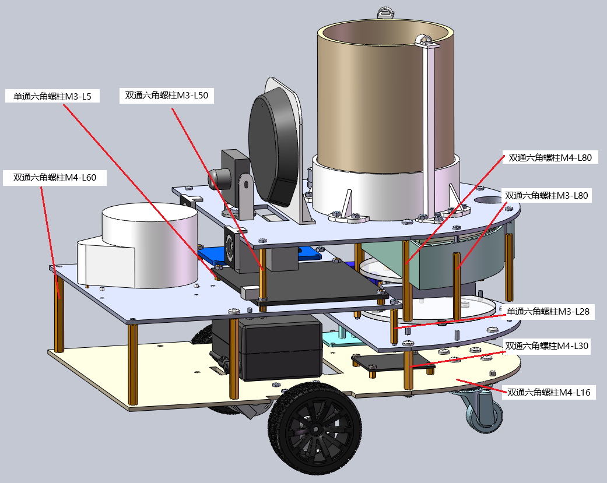

# 智能花盆---植物陪伴机器人

# 目录

[TOC]


# 项目介绍

​		该**智能花盆项目**，也称**植物陪伴机器人项目**，是基于 **AidLux 平台** 的一个实践型开发与实验仓库，使用阿加犀公司的开发板[犀牛派A6490PM1](https://e.tb.cn/h.huDp7wvc6znr8JO?tk=9Nrz4PhG3og )，主要围绕底盘控制、MCU开发、机器人导航、环境建图、语音交互以及多模块系统协同展开。该项目充分利用 AidLux 融合操作系统的特性，拥有在 Android 设备上运行完整 Linux 环境的能力，实现 Android 与 Linux 的无缝融合，而不是简单的双系统切换，并借助丰富的 AI 工具链与外设接口支持，为机器人应用的快速开发和部署提供了良好环境。

​		在功能层面，项目重点实现了ROS 导航与建图、 AI 语音交互、自动浇水和缺水寻人功能。通过引入 SLAM（同步定位与建图）算法与导航框架，机器人能够在未知环境中完成**地图构建**与自主定位，从而支持路径规划和**目标点导航**，并嵌入有动态障碍物识别功能，从而提升机器人在复杂环境下的导航安全性；作为陪伴机器人，通过本地部署的LLM模型，配合前后端的音频处理方法和模型，能和用户建立起有效的情感连接，同时使用 AidLux 平台迅速部署本地植物知识库，创建一个**掌握植物知识的聊天机器人**；为了更智能地管理植物，能让用户在种植一株植物，拥有一个陪伴聊天机器人的同时， 减少用户浇水次数，降低用户对植物的养护时间，我们使用温湿度传感器对环境进行实时监测，实现花盆的**自动浇水**，并且当机器人识别到备用水不足时，开启**人体检测功能**，得到人物坐标后导航到达人物附近并询问加水。

​		技术栈方面，项目覆盖了 **MCU嵌入式开发、Linux嵌入式开发、SLAM、NAV、ROS2 框架、机器视觉模型、大语言模型** 等内容，结合 AidLux 平台内置的开发环境，形成了一个软硬件一体化的研发生态。底盘使用STM32F407ZGT6作为控制板，基于FreeRTOS系统实现多传感器数据采集、自动浇水GPIO控制、USART与上位机通信、电机PID控制等多个任务，保证数据的实时性和各种功能的多线程运行；上位机A6490PM1使用ubuntu22操作系统，实现**基于 Transducer 的流式语音检测**，并通过**关键词检测策略**实现在线 KWS 功能、**基于WeNet模型**的ASR(声音转文字)、**基于WeTTS模型**的TTS(文字转语音)和**基于Qwen2.5-0.5B-Instruct_1-Q8模型**的文字交互功能，并对输入输出音频进行算法上的处理，以保证整体语音交流的顺畅的准确度；建图和导航的功能实现是**基于开源的gmapping算法**和名为**Navigation**的一个开源导航框架；最终，基于**ROS2框架**，将所有功能模块打包封装为软件包，并将各个**模块的桥接层功能实现**在一个中心控制软件包，以实现整体的初始化和工作调度。

[项目github链接](https://github.com/ztChina/aidlux_work)


# PC端软件下载

## vscode

下载链接：([Documentation for Visual Studio Code](https://code.visualstudio.com/docs/?dv=win64user))


## adb工具及其它刷机工具

软件下载链接： [软件工具安装包下载链接](https://file.aidlux.com/files?folder_id=ec5bf3bf)

#### USB驱动安装

- 解压USB_Driver_qud.win.1.1_installer_10061.1.zip文件。
- 解压后，双击setup.exe程序，等待跳出Qualcomm USB Drivers 安装界面，根据提示点击 next 即可。


#### ADB工具安装

##### 1、解压platform-tool.zip

- 将platform-tools.zip文件解压到D盘。

##### 2、配置adb环境变量

- 复制解压后的platform-tools路径。


- 鼠标右键点击此"电脑-属性"。


- 在弹出的设置窗口，点击"高级系统设置"。


- 在弹出的系统属性窗口-高级页，点击"环境变量"。


- 在弹出的环境变量窗口中，选中"系统变量"栏的Path变量，点击下方的"编辑"。


- 在弹出的编辑环境变量窗口中，点击"新建"，并添加前面复制的platform-tools路径。


- 依次点击"确认"来保存设置的变量，并退出。

##### 3、 验证adb环境配置是否可用

- 打开cmd窗口，输入adb，查看回显中存在[配置adb环境变量](#2、配置adb环境变量)章节复制的adb安装路径。


#### 刷机工具安装

- 解压QPST_2.7.496.zip文件到当前文件夹。
- 进入到解压后的QPST_2.7.496目录，双击QPST.2.7.496.1.exe程序，进行安装。


- 根据提示，一直点击"next"即可完成安装。
- 安装完成后的默认路径：C:\Program Files (x86)\Qualcomm\QPST\bin 。
- 可进入该目录，将QFIL.exe程序发送到桌面。


- 桌面图标如下。


#### 拷屏工具安装

提示

拷屏工具版本会不定时更新，请参考QtScrcpy-win-x64-v2.2.1版本进行安装。

- 解压QtScrcpy-win-x64-v2.2.1.zip到任意目录
- 进入到解压后的目录，找到QtScrcpy.exe文件


- 双击该可执行程序打开，当用Type-C线缆连接后，双击设备名则可以开始拷屏。
- 为方便下次使用，可以将该可执行程序发送到桌面快捷方式。


## Keil uvision5 MDK

`Keil uvision5 MDK`安装包：https://pan.baidu.com/s/5tx8NAAUpELTvOPtTsQl-Vg

`Keil uvision5 MDK`安装流程：https://mp.weixin.qq.com/s/63JQncEWlw8oFK8lX9IV4A


## STM32CubeMX

`STM32CubeMX`安装包：[【正点原子STM32】STM32CubeMX入门(搭建Java运行环境、STM32CubeMX安装、新建STM32CubeMX工程步骤、STM32CubeMX用户使用手册)-CSDN博客](https://blog.csdn.net/m0_62140641/article/details/135683008?ops_request_misc=elastic_search_misc&request_id=def7fb00d4eb530f62993a3be646d25e&biz_id=0&utm_medium=distribute.pc_search_result.none-task-blog-2~all~top_click~default-2-135683008-null-null.142^v102^pc_search_result_base3&utm_term=cubemx&spm=1018.2226.3001.4187)

`STM32CubeMX`安装流程：[【正点原子STM32】STM32CubeMX入门(搭建Java运行环境、STM32CubeMX安装、新建STM32CubeMX工程步骤、STM32CubeMX用户使用手册)-CSDN博客](https://blog.csdn.net/m0_62140641/article/details/135683008?ops_request_misc=elastic_search_misc&request_id=def7fb00d4eb530f62993a3be646d25e&biz_id=0&utm_medium=distribute.pc_search_result.none-task-blog-2~all~top_click~default-2-135683008-null-null.142^v102^pc_search_result_base3&utm_term=cubemx&spm=1018.2226.3001.4187)

`STM32CubeMX`使用教程：[【正点原子STM32】STM32CubeMX入门(搭建Java运行环境、STM32CubeMX安装、新建STM32CubeMX工程步骤、STM32CubeMX用户使用手册)-CSDN博客](https://blog.csdn.net/m0_62140641/article/details/135683008?ops_request_misc=elastic_search_misc&request_id=def7fb00d4eb530f62993a3be646d25e&biz_id=0&utm_medium=distribute.pc_search_result.none-task-blog-2~all~top_click~default-2-135683008-null-null.142^v102^pc_search_result_base3&utm_term=cubemx&spm=1018.2226.3001.4187)


## SSCOM串口通讯助手

`SSCOM`安装包：[百度网盘 请输入提取码](https://pan.baidu.com/share/init?surl=6xUcdI4pRaaCjPcHwjgPQA&pwd=mc4x)

`SSCOM`安装流程：解压后直接双击打开使用


`SSCOM`使用教程：[【工具】SSCOM V5.13.1串口工具-基础使用（图文详情）-CSDN博客](https://blog.csdn.net/qq_41539778/article/details/135965840?ops_request_misc=elastic_search_misc&request_id=40f3350096e9e331a27c51b9f7987276&biz_id=0&utm_medium=distribute.pc_search_result.none-task-blog-2~all~top_positive~default-1-135965840-null-null.142^v102^pc_search_result_base3&utm_term=SSCOM&spm=1018.2226.3001.4187)


## PCtoLCD2022（OLED屏显）

`PCtoLCD2002`使用教程：[LCD / OLED显示汉字，取模软件PCtoLCD2002完美版-CSDN博客](https://blog.csdn.net/luyibing2017/article/details/125317599?ops_request_misc=elastic_search_misc&request_id=daf0039462a81be1a7174b89d86c438d&biz_id=0&utm_medium=distribute.pc_search_result.none-task-blog-2~all~top_positive~default-1-125317599-null-null.142^v102^pc_search_result_base3&utm_term=pctolcd2002&spm=1018.2226.3001.4187)


## STM32F407芯片包下载

`STM32F407`芯片包下载：[STM32F407固件库的下载与安装_stm32f407固件库下载-CSDN博客](https://blog.csdn.net/rain_turns_shade/article/details/147116903?ops_request_misc=elastic_search_misc&request_id=7dc660502b3962ccf5f382ff442b4579&biz_id=0&utm_medium=distribute.pc_search_result.none-task-blog-2~all~sobaiduend~default-1-147116903-null-null.142^v102^pc_search_result_base3&utm_term=stm32f407芯片包下载&spm=1018.2226.3001.4187)


# 刷机部分

## 1、先安装win端工具 软件

链接：[AidLux](https://file.aidlux.com/files?folder_id=ec5bf3bf)

参考[安装方法](#adb工具及其它刷机工具)

## 2、再按照[美格6490刷机](.\code_part\test_code\刷机部分\美格(MC932)-QC6490-刷机流程.doc)流程刷机

其中使用到的固件版本文件[(A6490BM1-A14.zip)](.\code_part\test_code\刷机部分\)

## 3、ADB上传aidlux的SDK

type-c 连接板卡和笔记本，PC终端使用 `adb devices` 命令确定连接上开发板，打开[apk包](.\code_part\test_code\刷机部分\aidlux_2.0.1.1854_enterprise_qc6490_lu2204_robot_20250701-145237)后，直接点击install 就好，等到上传到100%

## 4、打开Qt拷屏桌面，打开一次桌面刷新

等到Qt桌面刷新到100%结束，再进行操作

## 5、进入web端，安装ros2和Ubuntu Desktop

参考[开发板安装软件](#7、开发板ros2及各种软件下载)

## 6、在普通用户和root的.bashrc文件中加入

```shell
# my config for work
# 这一句是将终端前面的提示词变为绿色
export PS1='\[\e[01;32m\]\u@\h:\w\$\[\e[00m\]'
# 下面两句是加载ros环境
source /opt/ros/humble/setup.bash
source /home/aidlux/[你的ros工作空间]/install/setup.bash
```

## 7、MC932-OTA版本升级操作：

​	1、有时需要更新板卡中的固件，需要做升级操作如下，

​	2、个人终端和板卡type-c连接

​	3、将OTA包通过adb push 命令上传到sdcard/update.zip

```shell
adb push D:\出货相关\MC932-融合系统\固件
ROM\SNM932-A14_EQ000_2774.867AEABBCE.C9B7386.A8D9AEA_250630_100_V01_T06_ota.zip sdcard/update.zip
```

​	 3、 push 成功后，执行如下命令，进行OTA升级

```shell
adb shell
ota
```

​	某些版本升级后检查：

​	1、执行如下命令，检查配置文件中是否新增eth0、eth1和wlan0 mac 地址，预期配置文件中有mac 地址回显

```shell
adb shell
cat /sys/devices/virtual/ssignrwtest/mytest_device/iopartition
```

2、执行如下命令，检查wlan0 的mac 地址与上述配置文件中记录的mac地址是否一致。预期ifconfig 命令实际查询额mac 地址与配置文件中的mac 地址一致。

```shell
ifconfig
```


# 常用操作

## 1、vscode使用SSH连接

vscode插件下载

	

选择ssh配置文件


按照下述格式书写添加SSH连接

```python
Host [name]
 HostName [IP]
 User [USER_NAME]
```


选择进入对象


然后输入密码并选择文件夹即可


## 2、打开windows终端

右键开始，选择`终端`即可，可以将其固定在任务栏


## 3、打开web端界面

在浏览器中使用IP:8000端口打开开发板的web服务，输入密码aidlux


## 4、打开ubuntu桌面


IP和端口5902，之后可以使用VNC连接


## 5、VNC进入ubuntu桌面


## 6、windows终端使用adb工具获取开发板IP


## 7、开发板ros2及各种软件下载

1. 浏览器访问板卡eth0 网口IP:8000 端口，进入aidlux 桌面

2. 打开App Store后，找到Ubuntu Desktop 应用

   

3. 点击右上角安装，等待安装完成即可

   

   4. ROS2-Humble、Gazebo、Moveit2 下载步骤同上


# bom（物料清单）

| 序号 | 名称                | 型号/规格                            | 数量 | 单位 |     备注     |
| ---- | ------------------- | ------------------------------------ | ---- | ---- | :----------: |
| 1    | 开发板              | 阿加犀-犀牛派A6490PM1                | 1    | 块   |    主控板    |
| 2    | 单片机              | STM32F407                            | 1    | 块   |  下位机控制  |
| 3    | 稳压板              | DC3.3V DC5V DC可调                   | 1    | 个   |  元器件供电  |
| 4    | TB6612电机驱动板    | AT8236双路直流电机带稳压驱动模块     | 1    | 个   |              |
| 5    | 电机                | MG513直流减速电机马达带GMR霍尔编码器 | 2    | 个   |              |
| 6    | 继电器              | 1路3.3V（红板支持高低电平触发）      | 1    | 个   |   控制水泵   |
| 7    | 微型蠕动泵          | 0.1-2ml/min）3V固定流量              | 1    | 个   |              |
| 8    | 压力传感器          | HX711                                | 1    | 个   | 压力监测水位 |
| 9    | 温度传感器          | DS18B20防水型温度传感器              | 1    | 个   |              |
| 10   | 湿度传感器          | DFRobot电容式土壤湿度传感器          | 1    | 个   |              |
| 11   | 激光雷达            | RPLIDAR A1高速版                     | 1    | 个   |              |
| 12   | USB摄像头           | F1080P_3.5mm90度（无畸变）           | 1    | 个   |              |
| 13   | USB麦克风音箱一体机 | G-MARK                               | 1    | 个   |              |
| 14   | mini下载器          | mini-HADAP                           | 1    | 个   |  单片机烧录  |
| 15   | USB转TTL模块        | CH340 USB转TTL                       | 1    | 个   |   打印调试   |
| 16   | 杜邦线              | 母对母 公对公 公对母                 | \    | \    |              |
| 17   | 12V10A电源分接线    | DC5.5一分三电源线                    | 1    | 个   |              |
| 18   | 电池                | 12V 5100mAh E351S                    | 1    | 个   |              |
| 19   | 万向轮              | 1英寸 万向轮金属牛眼轮               | 1    | 个   |              |
| 20   | 车轮                | 65mm橡胶车轮                         | 2    | 个   |              |
| 21   | 国产BPT管           | 1.5mm*2.5mm                          | 1    | 个   |     水管     |

点击查看[物料清单表(.xlsx)](.\物料明细.xlsx)


# 传感器配置和测试

## USB摄像头

### 1 准备

- 犀牛派A1
- 在AidLux-ubuntu22.04上预装ubuntu desktop、ros2、rviz2 具体安装方法可参照[开发板ros2及各种软件下载](#7、开发板ros2及各种软件下载)
- 复制[USB摄像头软件驱动包](.\code_part\src\camera_start_python)到你的工作空间

执行以下命令编译软件包

```shell
aidlux@aidlux:~$ cd my_ws/
aidlux@aidlux:~/my_ws$ colcon build
Starting >>> camera_start_python
Finished <<< camera_start_python [2.69s]          

Summary: 1 package finished [2.97s]
aidlux@aidlux:~/my_ws$ 
```


### 2 硬件连接

将USB摄像头连接到犀牛派的USB接口

### 3 测试

- 连接好后，通过如下命令启动相机驱动

```shell
aidlux@aidlux:~/my_ws$ source install/setup.bash 
aidlux@aidlux:~/my_ws$ ros2 run camera_start_python cam_pub 
```

- 打开终端并输入:rviz2

```shell
rviz2
```


- 在rviz2中验证打开相机图像画面

点击左下角Add按钮


在弹框中点击By topic


双击打开/camera节点下的image，观察到左下角的image弹框出现相机拍摄的画面


## USB麦克风音箱一体机

我们使用的是一个USB接口可以实现音箱和麦克风两种功能的一体化设备

连接好USB之后，设备音麦设备上显示亮灯，上为音箱，下为麦，亮蓝为打开，灭或者红光为关闭


### 1 准备

- 犀牛派A1
- USB麦克风音箱一体机

### 2 硬件连接

将USB头连接到犀牛派的USB接口

### 3 测试

#### 3.1 录音测试

- 列出所有录音设备

```
sudo arecord -l
```


找到USB Audio，读取到该设备的声卡编号即card x(x即为声卡编号)，读取到该声卡下的设备编号即device y(y即为子设备编号)，设备标识格式：hw:X,Y（X 是声卡编号，Y 是子设备编号）。当前示例读取出的设备标识为： hw:1,0

- 列出设备所支持的各项参数

```
sudo arecord -D hw:1,0 --dump-hw-params
```


注意如下几个参数：

FORMAT：设备支持的采样格式。目前支持的格式为：S16_LE

CHANNELS：表明设备支持的声道数量范围。当前声道数量为：2

RATE：显示设备支持的采样率范围，单位为HZ。目前支持的采样率为：44100 和 48000 (推荐48000)

- 开始录音

注意命令中的参数，需要与上一步骤查出来的值保持一致。如-f 即采样格式， -r即采样率， -c即声道数量，-d即录音时长。

```
sudo arecord -D hw:1,0 -f S16_LE -r 48000 -c 2 -d 5 output.wav
```


#### 3.2 音量设置

有些音箱插上去默认音量是0或者100，这有两种方式设置：

##### 3.2.1 使用命令 ` sudo alsamixer -c [声卡编号]` 修改声量大小

终端出现如下，可以通过上下键调节


##### 3.2.2 通过硬件规则绑定

###### 1、lsusb查看设备号

```shell
	Bus 002 Device 003: ID 1235:0002 Focusrite-Novation Speedio
```

###### 2、在root下使用 aplay -l查看卡号和名称，输出

```shell
card 1: Y11 [Y11], device 0: USB Audio [USB Audio]
  Subdevices: 1/1
  Subdevice #0: subdevice #0
```

发现设备名称Y11，和Focusrite-Novation不一致，使用Y11作为识别名

###### 3、使用amixer 查看通道

```shell
root@aidlux:/home/aidlux/aidcode/test#amixer -c 1
Simple mixer control 'PCM',0
  Capabilities: pvolume pswitch pswitch-joined
  Playback channels: Front Left - Front Right
  Limits: Playback 0 - 4096
  Mono:
  Front Left: Playback 819 [20%] [3.19dB] [on]
  Front Right: Playback 819 [20%] [3.19dB] [on]
Simple mixer control 'Mic',0
  Capabilities: cvolume cswitch cswitch-joined
  Capture channels: Front Left - Front Right
  Limits: Capture 0 - 4096
  Front Left: Capture 4096 [100%] [16.00dB] [on]
  Front Right: Capture 4096 [100%] [16.00dB] [on]
```

设备唯一暴露的音量play控制项（声音输出通道）为PCM

###### 4、创建文件/usr/local/bin/set-usb-audio-volume.sh

<span style="color:red">并使用chmod +x增加执行权限，否则规则文件命令没有执行权</span>

```shell
#!/bin/bash

# 获取 Y11 声卡的卡号
card_num=$(grep -m1 'Y11' /proc/asound/cards | awk '{print $1}')

# 验证卡号存在
if [ -n "$card_num" ]; then
        echo "检测到 Y11 声卡，编号为 $card_num"
        # 设置控制项
	 	amixer -c "$card_num" sset 'PCM' 20% 2>/dev/null || \
        echo "找不到匹配的控制项，需手动设置"
else
        echo "未检测到 Y11 声卡"
fi
```

###### 5、创建 udev 规则

创建一个规则文件，比如：

```shell
vim /etc/udev/rules.d/99-usb-audio-volume.rules
```

添加如下内容（替换 `1235` 和 `0002` 为你的设备 ID）：

```shell
ACTION=="add", SUBSYSTEM=="sound", ATTRS{idVendor}=="1235", ATTRS{idProduct}=="0002", RUN+="/usr/local/bin/set-usb-audio-volume.sh"
```

> #### 说明：
>
> - `ACTION=="add"` 表示设备插入时触发
> - `SUBSYSTEM=="sound"` 针对音频设备
> - `RUN+=...` 是触发脚本

###### 6、重新加载 udev 规则

```shell
udevadm control --reload-rules
```

然后重新插入你的 USB 设备，音量应该会自动设置为你脚本中设定的值。


#### 3.3 播放测试

- 列出所有播放设备

```
sudo aplay -l
```


找到USB Audio，读取到该播放设备的声卡编号即card x(x即为声卡编号)，读取到该声卡下的设备编号即device y(y即为子设备编号)，设备标识格式：hw:X,Y（X 是声卡编号，Y 是子设备编号）。当前示例读取出的设备标识为： hw:1,0

- 列出设备所支持的各项参数

```
sudo aplay -D hw:1,0 --dump-hw-params /dev/zero
```


注意如下几个参数：

FORMAT：设备支持的采样格式。目前支持的格式为：S16_LE

RATE：显示设备支持的采样率范围，单位为HZ。目前支持的采样率为：44100 48000

- 根据以上参数值可以看到，其中播放设备的采样率与录音设备的采样率一致，都为 44100 96000。但是有些设备的播放采样率与录制采样率不一致，因此我们需要将录好的音频转换一下采样率，如转换成48000的采样率，方法如下：

- 安装转换工具

```
sudo apt update
sudo apt install sox libsox-fmt-all
```

- 开始转换

```
sudo sox output.wav -r 48000 output.wav
```

如果播放采样率与录制采样率一致可跳过上述步骤


开始播放录好的音频

注意命令中的参数，需要与上一步骤查出来的值保持一致。如-f 即采样格式， -r即采样率， -c即声道数量。

```
sudo aplay -D hw:1,0 -f S16_LE -r 48000 -c 2 output.wav
```


## 激光雷达

### 1 准备

- 犀牛派A1
- 激光雷达

### 2 硬件连接

将USB头连接到犀牛派的USB接口

### 3 测试

#### 3.1 绑定雷达端口名称

雷达选用思岚—A1，该型号的雷达驱动包及相关配置文件已经整合 [src](./code_part/src/) 到`rplidar_ros`和`slam_gmapping`文件夹下，故目前只需要绑定雷达端口名称。

```python
#打开一个终端输入以下命令，将rplidar_ros文件夹下的scrips文件复制到/etc/udev/rules中
cd ~/src/rpliar_ros/scripts
sudo cp rplidar.rules /etc/udev/rules.d/
```

使用`Type_c`线将雷达和电脑连接起来，并在以上操作的终端中输入`lsusb`查看雷达的端口号

```python
#输入以下命令用于查看雷达端口号
lsusb
```


记住这个框起来的端口号,进入`/etc/udev/rules.d`目录 ，修改端口号

```python
cd /etc/udev/rules.d
sudo nano rplidar.rules
```


修改后按ctrl+s保存，然后按ctrl+x退出，运行修改后的规则文件

```python
sudo udevadm trigger
sudo service udev reload
sudo service udev restart
```

重新拔插雷达串口，终端输入 `ll /dev/rplidar`

```python
`ll /dev/rplidar`
```


出现以上内容则表示绑定成功，结尾不一定是0，根据插入设备的顺序而改变 若未出现以上内容，在点击其他位置，打开计算机，打开`dev`，在里面查找是否有` rplidar `文件


如果出现，则表示连接成功。如果没有出现，可多次尝试拔插雷达串口。

#### 3.2 雷达测试

接下来进行雷达测试，将雷达和电脑连接上后打开雷达开关，运行`"code_part\src\rplidar_ros\launch"`下的`rplidar_a1_launhc.py`文件。

```python
ros2 launch rplidar_ros rplidar_a1_launch.py

```

另开一个终端，在终端中输入以下内容用于查看雷达数据

```python
ros2 topic echo /scan
```


在启动雷达点云图文件前先结束上文中启动的查看`/scan`话题的命令，在输入`ros2 topic echo /scan`的终端中输入`Ctrl+c`命令用于停止以上命令，然后启动`view_rplidar_a1_launch.py`文件

```python
# 启动view_rplidar_a1_launch.py文件用于在rviz中查看雷达点云图
ros2 run ${view_rplidar_a1_launch.py文件所在的功能包名}view_rplidar_a1_launch.py
```

注意：`view_rplidar_a1_launch.py`为测试文件，启动前需要将该文件从`test`文件夹中移动到正式代码文件夹`src`中，该命令中的最后一项可执行文件名称需要以python功能包中的`set.up`文件内对应的可执行文件名称为主。具体操作见[链接]([重学ROS2:（5）使用功能包组织ROS中的节点[Python/C++] - 陶小桃Blog (52txr.cn)](https://www.52txr.cn/2025/packnode.html))。

完成以上操作后新开一个终端用于启动`rviz`

```python
# 启动RVIZ
rviz2
```

启动后点击坐下角的`add`选项，在新弹出的界面中选择`by topic`下滑找到`LaserScan`将他添加到`rviz`中，如果操作正确`rviz`中将会出现以下画面


## MG513直流电机

### 1 准备

- 犀牛派A1
- MG513直流减速电机马达
- TB6612电机驱动板
- Windows系统电脑
- STM32F407ZGT6开发板
- mini下载器
- 杜邦新若干
- USB转串口模块

### 2 硬件连接

需要将电机与电机驱动板相连，电机驱动板与STM32F407ZGT6通过杜邦线相连，USB转串口通过杜邦线与STM32F407相连，USB接电脑，下载器通过杜邦线与STM32F407直接相连，USB接电脑，按照如下接线

电机驱动板`Input_IO`接线，从下向上

```
PWMA -> PB10
AIN2 -> PD1
AIN1 -> PD0
STBY -> PB2
BIN1 -> PD2
BIN2 -> PD3
PWMB -> PB11
```

电机驱动板`Output_IO`接线，从上向下

```
E2B -> PD13
E2A -> PD12
E1B -> PA7
E1A -> PA6
GND -> STM32的GND
```

电机驱动板与电机接线

```
排线两头分别插电机和电机驱动板上即可
```

串口转`TTL`接线

```bash
GND -> GND
TXD -> PD9
RXD -> PD8
# 以下三个串口均为供电串口，三选一接即可
VCC -> 5V/3V3
3V3 -> 3V3
5V -> 5V
```

下载器连接`STM32F407ZGT6`（为单片机供电）

```
GND -> GND
SWC -> CLK
SWD -> DIO
3V3 -> 3V3
# 第二种供电（通讯）方式
Type-c直连USB UART
```


在这一部分，请确保$STM32F407ZGT6$通电，电机驱动板通电，接线没有短路，断路等情况，并且电机驱动板开关常开

### 3 测试

打开电机测试专用 `keil` 项目的 [test_us.uvprojx 文件](.\code_part\test_code\嵌入式部分\PID调参(电机部分)\MDK-ARM\test_us.uvprojx)

看到 `serial_command.c` 文件中 `PID` 控制部分


编译下载好程序后，打开`SSCOM`串口通讯助手，在此处选择你的串口号。如果不知道串口号，可以在未插上串口通讯时看一下已有的串口号，插上后存在的串口号（可能会多出两个，需要一个个是，一般是多出两个的第一个）


然后选好串口后，点击打开串口


点击后，变成这样，即为串口成功打开，可以进行通讯


要确保波特率、数据位和停止位与该串口通讯的设置值一样


该值可以在$STM32CubeMX$的该串口通讯的USART下的`Parameter Setting`查看（例如，我电机使用的是USART3串口进行通讯，我就选择USART3的`Parameter Setting`）


> [!CAUTION]
>
> SSCOM中的那部分值一定要与这部分相同，不然无法进行通讯
>
> 同时，如果修改，请一定要记得重新生成代码，即右上角的`GENERATE CODE`

上述配置完成后，可以在此处选择发送选择

在这里，你可以选择定时发送，只需要在输入框中输入发送的值，然后勾选定时发送，即可实现定时发送的功能，或者手动点击发送也可以。发送示例：`V+0.5+0.5E\n`，其中，`V`和`E\n`以及符号为必须有，符号可以为`+`也可以为`-`数值可以随机改，但一般不超过1.3（最大速度设置为1.3m/s）


> [!NOTE]
>
> 如果需要修改速度，则需要在$STM32CubeMX$中修改定时器的值，本项目中选择的驱动电机的定时器为`TIM2`、`TIM3`和`TIM4`需要将这里面的`Parameter Setting`中的`Counter Period`的值增大或减小即可
>
> 
>
> 同时，如果修改，请一定要记得重新生成代码，即右上角的`GENERATE CODE` 

具体测试效果类似如下图所示，由于PID算法的存在，速度从0逐步增加，直到0.5m/s为止


### 


## HX711压力传感器

### 1 准备

- 犀牛派A1
- HX711压力传感器模块
- USB转串口模块
- STM32F407ZGT6开发板
- mini下载器
- Windows系统电脑
- 杜邦新若干

### 2 硬件连接

将HX711与$STM32F407ZGT6通过杜邦线相连，USB转串口通过杜邦线与STM32F407相连，USB接电脑，下载器通过杜邦线与STM32F407直接相连，USB接电脑，按照如下接线

串口转`TTL`接线

```bash
GND -> GND
TXD -> PD9
RXD -> PD8
# 以下三个串口均为供电串口，三选一接即可
VCC -> 5V/3V3
3V3 -> 3V3
5V -> 5V
```

下载器连接`STM32F407ZGT6`（为单片机供电）

```
GND -> GND
SWC -> CLK
SWD -> DIO
3V3 -> 3V3
# 第二种供电（通讯）方式
Type-c直连USB UART
```

压力传感器模块连接`STM32F407ZGT6`

```
# 首先将压力传感器与称重的连接好（会有线连接，注意防呆）
# 然后按照对应的线与引脚连接
# 左侧红线对应右侧第一个引脚，黑线对应右侧第二个引脚
# 白线对应右侧第三个引脚，绿线对应右侧第四个引脚
GND -> GND
DT -> PE9
SCK -> PE8
VCC -> 3V3
```


### 3 测试

打开 `keil` 项目的 [test_us.uvprojx 文件](.\code_part\test_code\嵌入式部分\FreeRTOS\MDK-ARM\test_us.uvprojx)

点击`freertos.c` ，看到


屏蔽所有任务只保留 `StartTask08` 


`StartTask08` 任务内容如下


编译上传 STM32 之后，打开PC端串口助手，看到输出

注：质量数据没有去皮


## OLED显示屏

### 1 准备

- 犀牛派A1
- OLED显示屏
- USB转串口模块
- STM32F407ZGT6开发板
- mini下载器
- Windows系统电脑
- 杜邦新若干

### 2 硬件连接

将OLED与STM32F407ZGT6通过杜邦线相连，USB转串口通过杜邦线与STM32F407相连，USB接电脑，下载器通过杜邦线与STM32F407直接相连，USB接电脑，按照如下接线

串口转`TTL`接线

```bash
GND -> GND
TXD -> PD9
RXD -> PD8
# 以下三个串口均为供电串口，三选一接即可
VCC -> 5V/3V3
3V3 -> 3V3
5V -> 5V
```

下载器连接`STM32F407ZGT6`（为单片机供电）

```
GND -> GND
SWC -> CLK
SWD -> DIO
3V3 -> 3V3
# 第二种供电（通讯）方式
Type-c直连USB UART
```

`OLED`连接`STM32F407ZGT6`

```
GND -> GND
VCC -> VCC
SCL -> PB6
SDA -> PB7
```


### 3 测试

打开 `keil` 项目的 [test_us.uvprojx 文件](.\code_part\test_code\嵌入式部分\FreeRTOS\MDK-ARM\test_us.uvprojx)

点击 `freertos.c` ，看到


屏蔽所有任务只保留 `start_oled_debug_task` 


`start_oled_debug_task` 任务内容如下


编译上传 STM32 之后，OLED屏上显示


## DS18B20温度传感器

### 1 准备

- 犀牛派A1
- DS18B20温度传感器
- Windows系统电脑
- STM32F407ZGT6开发板
- mini下载器
- 杜邦新若干
- USB转串口模块

### 2 硬件连接

将DS18B20与STM32F407ZGT6通过杜邦线相连，USB转串口通过杜邦线与STM32F407相连，USB接电脑，下载器通过杜邦线与STM32F407直接相连，USB接电脑，按照如下接线

串口转`TTL`接线

```bash
GND -> GND
TXD -> PD9
RXD -> PD8
# 以下三个串口均为供电串口，三选一接即可
VCC -> 5V/3V3
3V3 -> 3V3
5V -> 5V
```

下载器连接`STM32F407ZGT6`（为单片机供电）

```
GND -> GND
SWC -> CLK
SWD -> DIO
3V3 -> 3V3
# 第二种供电（通讯）方式
Type-c直连USB UART
```

温度传感器模块（`DS18B20`）连接`STM32F407ZGT6`

```
GND -> GND
DIO -> PB15
VCC -> 3V3
```


### 3 测试

打开 `keil` 项目的 [test_us.uvprojx 文件](.\code_part\test_code\嵌入式部分\FreeRTOS\MDK-ARM\test_us.uvprojx)

点击 `freertos.c` ，看到


屏蔽所有任务只保留 `start_collect_task`


`start_collect_task` 任务内容如下


编译上传 STM32 之后，打开PC端串口助手，看到输出


## DFRobot湿度传感器

### 1 准备

- 犀牛派A1
- DFRobot电容式土壤湿度传感器
- Windows系统电脑
- STM32F407ZGT6开发板
- mini下载器
- 杜邦新若干
- USB转串口模块

### 2 硬件连接

将DFRobot与STM32F407ZGT6通过杜邦线相连，USB转串口通过杜邦线与STM32F407相连，USB接电脑，下载器通过杜邦线与STM32F407直接相连，USB接电脑，按照如下接线

串口转`TTL`接线

```bash
GND -> GND
TXD -> PD9
RXD -> PD8
# 以下三个串口均为供电串口，三选一接即可
VCC -> 5V/3V3
3V3 -> 3V3
5V -> 5V
```

下载器连接`STM32F407ZGT6`（为单片机供电）

```
GND -> GND
SWC -> CLK
SWD -> DIO
3V3 -> 3V3
# 第二种供电（通讯）方式
Type-c直连USB UART
```

湿度传感器（`DFRobot`）连接`STM32F407ZGT6`

```
A -> PA1
+ -> 3V3
- -> GND
```


### 3 测试

打开 `keil` 项目的 [test_us.uvprojx 文件](.\code_part\test_code\嵌入式部分\FreeRTOS\MDK-ARM\test_us.uvprojx)

点击 `freertos.c` ，看到


屏蔽所有任务只保留 `start_collect_task`


`start_collect_task` 任务内容如下


# 嵌入式部分

## 1.软件需求

### （1）Keil uvision5 MDK

`Keil uvision5 MDK`安装包：https://pan.baidu.com/s/5tx8NAAUpELTvOPtTsQl-Vg

`Keil uvision5 MDK`安装流程：https://mp.weixin.qq.com/s/63JQncEWlw8oFK8lX9IV4A

### （2）STM32CubeMX

`STM32CubeMX`安装包：[【正点原子STM32】STM32CubeMX入门(搭建Java运行环境、STM32CubeMX安装、新建STM32CubeMX工程步骤、STM32CubeMX用户使用手册)-CSDN博客](https://blog.csdn.net/m0_62140641/article/details/135683008?ops_request_misc=elastic_search_misc&request_id=def7fb00d4eb530f62993a3be646d25e&biz_id=0&utm_medium=distribute.pc_search_result.none-task-blog-2~all~top_click~default-2-135683008-null-null.142^v102^pc_search_result_base3&utm_term=cubemx&spm=1018.2226.3001.4187)

`STM32CubeMX`安装流程：[【正点原子STM32】STM32CubeMX入门(搭建Java运行环境、STM32CubeMX安装、新建STM32CubeMX工程步骤、STM32CubeMX用户使用手册)-CSDN博客](https://blog.csdn.net/m0_62140641/article/details/135683008?ops_request_misc=elastic_search_misc&request_id=def7fb00d4eb530f62993a3be646d25e&biz_id=0&utm_medium=distribute.pc_search_result.none-task-blog-2~all~top_click~default-2-135683008-null-null.142^v102^pc_search_result_base3&utm_term=cubemx&spm=1018.2226.3001.4187)

`STM32CubeMX`使用教程：[【正点原子STM32】STM32CubeMX入门(搭建Java运行环境、STM32CubeMX安装、新建STM32CubeMX工程步骤、STM32CubeMX用户使用手册)-CSDN博客](https://blog.csdn.net/m0_62140641/article/details/135683008?ops_request_misc=elastic_search_misc&request_id=def7fb00d4eb530f62993a3be646d25e&biz_id=0&utm_medium=distribute.pc_search_result.none-task-blog-2~all~top_click~default-2-135683008-null-null.142^v102^pc_search_result_base3&utm_term=cubemx&spm=1018.2226.3001.4187)

### （3）SSCOM串口通讯助手

`SSCOM`安装包：[百度网盘 请输入提取码](https://pan.baidu.com/share/init?surl=6xUcdI4pRaaCjPcHwjgPQA&pwd=mc4x)

`SSCOM`安装流程：解压后直接双击打开使用


`SSCOM`使用教程：[【工具】SSCOM V5.13.1串口工具-基础使用（图文详情）-CSDN博客](https://blog.csdn.net/qq_41539778/article/details/135965840?ops_request_misc=elastic_search_misc&request_id=40f3350096e9e331a27c51b9f7987276&biz_id=0&utm_medium=distribute.pc_search_result.none-task-blog-2~all~top_positive~default-1-135965840-null-null.142^v102^pc_search_result_base3&utm_term=SSCOM&spm=1018.2226.3001.4187)

### （4）PCtoLCD2022（OLED屏显）

`PCtoLCD2002`使用教程：[LCD / OLED显示汉字，取模软件PCtoLCD2002完美版-CSDN博客](https://blog.csdn.net/luyibing2017/article/details/125317599?ops_request_misc=elastic_search_misc&request_id=daf0039462a81be1a7174b89d86c438d&biz_id=0&utm_medium=distribute.pc_search_result.none-task-blog-2~all~top_positive~default-1-125317599-null-null.142^v102^pc_search_result_base3&utm_term=pctolcd2002&spm=1018.2226.3001.4187)

### （5）STM32F407芯片包下载

`STM32F407`芯片包下载：[STM32F407固件库的下载与安装_stm32f407固件库下载-CSDN博客](https://blog.csdn.net/rain_turns_shade/article/details/147116903?ops_request_misc=elastic_search_misc&request_id=7dc660502b3962ccf5f382ff442b4579&biz_id=0&utm_medium=distribute.pc_search_result.none-task-blog-2~all~sobaiduend~default-1-147116903-null-null.142^v102^pc_search_result_base3&utm_term=stm32f407芯片包下载&spm=1018.2226.3001.4187)

### （6）关于串口重定向

串口重定向是在使用串口通讯助手时，要将单片机返回值打印在屏上的工具，即`printf`，详看

https://blog.csdn.net/struggle_success/article/details/134621868


## 2.代码准备

### （1）相关程序下载（GitHub）

从此部分下载嵌入式部分相关程序

[ztChina/aidlux_work: 基于APLUX犀牛派A1开发板QC6490的AI聊天植物机器人，集成嵌入式、大语言模型、SLAM、视觉检测、机械设计](https://github.com/ztChina/aidlux_work?tab=readme-ov-file)

下载流程：首先，打开上述链接，如图所示方式下载


或者进入文件夹[嵌入式部分](.\code_part\test_code\嵌入式部分)

### （2）项目工程文件展示与介绍

下载完成后，打开其中的嵌入式部分


其中，每个部分具体完成任务请查看嵌入式部分中的`readme.md`文件。

以嵌入式文件夹中的`motor`文件夹为例，该文件夹主要完成了控制电机转动的程序

在这部分文件夹中，这一文件主要完成电机相关引脚等的配置


如若在打开过程中出现如下界面，此为版本问题冲突，请选择`continue`


电机控制的总代码则在MDK-ARM中的`motor`，双击打开如下图所示文件


打开后界面如下所示：


## 3.前期准备

本次实验所用到的开发板为`STM32ZGT6`开发板

[正点原子最小系统板STM32F4单片机+Mini下载器×1](https://detail.tmall.com/item.htm?id=609293805821&ns=1&pisk=gOx-02_fsjcuTCPzeB00KuKzsSDc2qvzDQJ_x6fuRIdvIIMP-XJCdMdXtY5kdbRpvs9eraj5twCBsBBHqHxpukpwL3DPxYSyUMSIsfjdvLJPYtMAtN-8Gt66hk65AqjjNxh2LfmijK35UMvjsHvfDQXcIksCPwabGsWaOWOCRo9fg9WQN9ZSHK1VGTZ5F_1blO68OM6CAm_fE9PCOTZCli1VdM1BOMMAcsWCA6OCAvkxKsaFOkL-wpe48DUavkKAeaCLxsEp93qGk1sFGkG6XTFN1L1YRy1t5T3BHLc8bKjyhCBMZmZJ6d-2MtOsvjIegeOCpIiatg8Mah7v3VZXngCV5Otjdl1H2Ev1MGeIVKIRwNtlPRqM1KpBSZKmCcSRV_Th4p2tZKKJZL-vKJaf2gYAW3Isb71HodKdpHlEDCpw0IBX1Dh54SKMXe-gstL3PxHY8yS53k9eLwe8RUVdH1D--yzFoV6AsxHY8y753tCie24U8Z01.&priceTId=2147873817561766719308757e2c9d&skuId=4403312853780&spm=a21n57.sem.item.45.26b73903ISP0rQ&utparam=%7B%22aplus_abtest%22%3A%2286e746a4296b76e80a3397ee5b63433d%22%7D&xxc=ad_ztc)

[轮趣科技TB6612电机驱动板](https://item.taobao.com/item.htm?id=43963555491&mi_id=KSMTQYWsdQ4jhtcVAF9md1BSySkH7vqftup8LKS4CM5jtfQ5s_Ebk3ev-N8zt5QrPeDYUNNpKTivQ1enHEhMBGwLEjU7d4pqaFI0uSrbhgA&skuId=5788546487912&spm=a21n57.shop_search.0.0.6cbf523cXDwAYc)

正点原子`ATK-BLE04/05`双模蓝牙串口，[ATK-BLE05插针版](https://detail.tmall.com/item.htm?app=chrome&bxsign=scdFF75I6dABuRjCaTjgfVXvovC5tylZ5PwzjagnnSzwLIU7dR-ALA0bqNJHPvYIMmrWxHNvPj6SAquUJ3rgjMxu4PAo4iop45beKADb5DhYqcTBDqkf6GE4Uf8O-pER94dHcUzkbPNz0t5LEziw_WeCQ&cpp=1&id=927120447130&price=11.06&shareUniqueId=32317970945&share_crt_v=1&shareurl=true&short_name=h.h6nvIdHND0NAXiv&skuId=5977446827574&sourceType=item&sp_tk=UjlUejRaYVhWOG8%3D&spm=a2159r.13376460.0.0&suid=987eabcb-5e12-4de6-b2ba-3ad10a89f61e&tbSocialPopKey=shareItem&tk=R9Tz4ZaXV8o&un=dd1e236544aeb5f05842554799123905&un_site=0&ut_sk=1.YukyTafEZr8DAEF8%2Fhofd7FI_21646297_1751936994291.Copy.1&wxsign=tbwcs1uD2PkAZuOUxiAvf4YbghxppDAkKuxqfReTLdxM0DnDk4TUZse07n0pC6mjTAvnrADpvUw5ehiXn-fSUCm9m-NsDaps0dk3lNMmmZZZOWyU7Vbb6F20HBu3bPQFsQ7x9Uysu597Ho2aoGHNJkJjQ)

力士微型蠕动泵`LFP101ADB`，[（0.1-2ml/min）3V固定流量](https://item.taobao.com/item.htm?id=675821328866&ns=1&pisk=gKliYfwUGAy_EE-LpXN6UiQ3kv9LW5NbqmCYDSE2LkrCBSpskrDnPmq9ldNtKomExl595Vn3um0jBFwvfZbst0fA6h9susVYg3KJwQ31WSN22R82aKs_rr4wMlyN85aAWLrEhQ3s5o_G0UHewZx0XKbN3oo4TWzToSzagRWe-rUG0Sra3MWUzkP4gPP48Jz8lGz4bmWFYzUauPra3w7UrzF40my2-2rQoSrqNFf4qjlITHQ6-5IrJhcLSRqr7lutWX-aLOg3xbc-TP032VWfgsl3SRcUpW7luRHqP8GtzIfQ64DUTrcXztq0ExlTTf-eaJwqTDzEXEBb-x0qN5NluCu3sl2rTR_Ng0unuYen9UR7s5rZH5gArh3nsc3stqQVL5VtK8cgaQsaDv3oircXcBmou4M4KjjG4OBFUggOGgTmOt6bQya32DVw4GWk_tqW-eXWCRzQW3LH-t6bQya32eYhFGwaRPKR.&priceTId=215042c517518533935244319e1b6a&skuId=5034909211780&spm=a21n57.sem.item.2.293a3903JGbQGV&utparam=%7B%22aplus_abtest%22%3A%22f6ff72c2c7b3fbfcbe71dfc1e0e251ba%22%7D&xxc=ad_ztc)

温度传感器：[DS18B20防水型温度传感器](https://e.tb.cn/h.h6nIHdvm45txDnt?tk=NhDf4ZaaVHe)

湿度传感器：[DFRobot电容式土壤湿度传感器模块干湿度检测](https://e.tb.cn/h.h6ps4ZP2IEKIbNw?tk=YQNT4ZabD9y)

`USB`转`TTL`， [CH340模块小板](https://detail.tmall.com/item.htm?id=41323941056&price=6.26&sourceType=item&suid=606e6a43-5a28-4cec-9491-763c8fd90db0&shareUniqueId=32279144808&ut_sk=1.YukyTafEZr8DAEF8%2Fhofd7FI_21646297_1751622554939.Copy.1&un=dd1e236544aeb5f05842554799123905&share_crt_v=1&un_site=0&spm=a2159r.13376460.0.0&wxsign=tbwcSUxxw_mw5Ouz5JUqzqHM1pIgr5yUDxZmXAOjTEuFp3ax6SS9tH8AuujBnGRU66dvFLz3V3KOLBm0tUXvi1Ccsk-dNqFVx75-0vmBFpc1PJqtHuy62y4_qg_xGeG8QeQ1fHJA90lQ5-RdMuz2767cw&tbSocialPopKey=shareItem&sp_tk=OHJPWFZ6THJ2aWU%3D&bc_fl_src=share-1041209578049345-2-1&cpp=1&shareurl=true&short_name=h.hgT24YO5VeOL51y&bxsign=scdodSWduea0h0oJRsf8Z4RXMdH5aft5Xda-vFG3leviOP_44w0map_n3-Yr24NAyi3yVkG0aMoLvUhH_26XbxzWaPtH5jFQwmYHpztIvvQBSCBUb1Yu1s09I58eKuYRr7sRQJplR1Oi0Pij364jtQnag&tk=8rOXVzLrvie&app=weixin)

压力传感器：[HX711](https://detail.tmall.com/item.htm?id=689424092425&ns=1&pisk=gK8rc6fE843rfCXRqE_U3rQZXiQJnwk6qe6CtBAhNTXlNp_eYdBbRbQSvwJF3pB5VaX78eWDsXUSw0IhLLQlv36CF97e9dljCVg6wQQdqAMs5k9YgG7Trzjudt2cww5u15bmDQQd-vPb-cgwwLpOA7rhtscVO6PlZpjki-fCn6ql-pXcm1f_EwvHKt0cw1PuEuj3ioXA1JVlKMfDi_1Q-6fkKIcV9tXh-gvHib8MZB4V1gcKejWBKqEYuOdl3y4Hr2nfQQP-PCJVaj66atkMtEfzBOAl3y4hQnClYIRSUPdfyevN1Lg0zdRH6Hj28-DNpERDrHAYUjbwgnt14nku8tT5TGbh0W4HgZWAmebiS-5vmQtHyLPU-_LW5MWO0X4dAZY1jhvz9fdcr6vdXeMTyTAH6FK174yOanANuglLps4Bpe3QHkSlMsWsgjWK1UCutD-exkEdmNCVCb17vkIlMsWsgjrLvifOgOG5N&priceTId=2147822717516088515017145e1adc&spm=a21n57.sem.item.139.3b143903TEElYx&utparam=%7B%22aplus_abtest%22%3A%227e30e0f4a33750e440331b0158794111%22%7D&xxc=ad_ztc)

[12V10A电源分接线 DC5.5一分三电源线5.5*2.1](https://item.taobao.com/item.htm?id=608066889564&pisk=gHdtjU26oDmi_yAO-Fk3mP3HNV03BvYwJh87iijghHKpjU9GIEscMnKvDGXjb1AvvhYWIOYXiZOA_BvgiGmNMEtlM0moZbYw765jq0fRZf6O_ZQf5ZZcdk_fMN1hPwcW7s5jqyVjEbLwbHaDgS1jJ6_AWZ1flNNIJZQ7fss1hkwCPM1fGi6fAy_RPSw1cRgLdZ71c-_bGyGCraVfGstbR2QVAZ1fGjVYWi41DSpojb9K22lbMSddWOIYiMFvIBPlCgiOASFAXhXTSFsLGSOpL8zl_GMz-i5GbE790bPN1tp6Xw1xMW19bFOfpImnZOL5ln5MOqw1VdxGOC98lSTd6G6DOHqtvgOwRQ5CKbgJRB-M7BL0lj_HqMTw1shSz1C1f6QeiDP1Dp9XsO54fcCXJZsrQQAJl7rl2Z2sJ2e43O_edqthtl05hsQdq2233-Wh8wIoJ2e43O_FJg03K-yVKw5..&spm=pc_detail.29232929%2Fevo365560b447259.guessitem.d4&skuId=4441787379004)

电池，[12V9000mAh+2A充电器](https://item.taobao.com/item.htm?id=558538974777&ns=1&pisk=guBiYhwFi1R6Ci4p999_a4syUjPL5d9XrZHvkKL4Te8I6KF1DnfhVZYTc59OtEbF-FkTfGQH0Zjf6lOY5mm1KaDxBPN10xvv3zU8e8I_fK94yiY8Ic36m3haHFlwYdtxX78FG8I1fEiiuuCUemqc2RoZgE72LB-JjK-w3AkUxnKS_K8wg2le4eJ23Ekq82-Xmf-ZQZkELhtoQqlZQHue4392uZk4xM8BmK8qi0Fw5tWFLynLpbRWTx6ejCYPbFSOX9kW6fsM-F81LhjH8GPj3xWHjCXvzM2TdCCVVQ6OX-DBBgfeLhb4UPJF46jJsO4oBEOcKNfcWohXxsjVFd9o0RSHIFAPICizVaSh0_dhpuyWId8NMdsxqPIhINI1KinqTdvOtQXMU8gwk6IlnnXblJblb_7VigPoTbySCxtUD9ljGC-BxUhFBUrjJXaNdkqnaoOwAhT8xkcjGC-BxUE3xbrX_Ht6y&priceTId=213e052d17519384112456464e1af7&skuId=5219353081192&spm=a21n57.sem.item.1.87a83903LtMA1l&utparam=%7B%22aplus_abtest%22%3A%22e12fadcfca959e3577cd1de14443b247%22%7D&xxc=ad_ztc)

杜邦线： 母对母 公对公 公对母，[40CM纯铜](https://detail.tmall.com/item.htm?id=42363282832&ns=1&pisk=g86sxtm9gV0sbzJxcCqEdpA0FN9bhkyzfmtAqiHZDdptHo_V8tRvu5bXGZ7HMOJNbwTAzwTt3SYZhKsfoZ7fmlxvkZQXu1PUUGjMnKUyh8yPjjuAjzQ6MxhLDnKDkkRta_Q5CKUzz-GEvC4wHZ5VIhiK93YpXnKt6kwpjn9vDhpYAeKXqj3OkZEB93xtXqK9kXIpVeHvDFKvJBKM0qH9MZILAnYpkKdOkMhAnyt31FI_bp2Iysq4rgLIHxBBArY1flMDvTK6lUsO7xHYmhO6yGLQzcRCmBIDGtmmhCSOZZxRWVU6HMt5P3__gmY19gWNMGwQydWGX_dAercAPd_XwOdIDxsMd1JBvTEqZeWB7ZB69ukWgpBywdCUtPR2C3_AINijHaIF4OAhhzgpo1-kph_Yeysr-Y8WubljAQDXAUrQAjccfPgFUO4GzOR9xHWzAkgsiCKHAUrQAjcD6HxFUkZI5jf..&priceTId=2150450917515333296105457e19d7&skuId=3100534316753&spm=a21n57.sem.item.81.27c83903jd5YNy&utparam=%7B%22aplus_abtest%22%3A%221565309c9680fef715fdf72ce56933f8%22%7D&xxc=ad_ztc)

`OLED`屏：[0.96寸白色OLED模块/4针](https://item.taobao.com/item.htm?id=960905118150&ns=1&pisk=gWvxVkf5-40c4NU4DFcuj-LsVRmoWbx4eE-QINb01ULJxUiVsV-1fOLWSm7Dfq89BatwisXfS1Q6-FIMndv9aRKebKmVImW20OWs-2XOBn-VQIISFipOFasNxA2bh16VFonlPhknKn-8miiHVvvMpuBl25w65s17NM_7lSsX5_w5bawff-s_P0INPOZbCiw7FMs3GoT_G7t5mGNfcsw1F8sNPN61CFtS2Gb55O6653Mj1cb7_Nw9MqdmJCG_CR2MeiCAWRjTB3J3K1QIrawTBZQ1MSxfyRN6eCnCd8_jTubNnZJODFkU3t19Thj9kxeXWHJyygTIBJbX4HAhgKGgK6Bck1vXWVFODBYv7ZtblSsdHZCBh_rLQ3C6wLBDhVPeq3Qf9TAoaqfGHEdF8sGrzFKRoF9ANr3lSBxkh_LIr8LN6B-GXEHYhesyHpvp_p4h2CVj20Fa_tszCh-N6oF6iPIR-mhg_55oOgQn20Fa_ssP2wmxs5PNZX1..&priceTId=2147bfc617561784443958667e1a65&skuId=5893411092004&spm=a21n57.sem.item.47.13983903Ox2sH9&utparam=%7B%22aplus_abtest%22%3A%222777ee64df5f75c678616443dd1ee0ca%22%7D&xxc=ad_ztc)

电机（轮趣科技）：[MG513直流减速电机马达带GMR霍尔编码器](https://detail.tmall.com/item.htm?abbucket=1&id=645920794388&ns=1&pisk=gL9oc1D2tQ5Shk3AMK6S_-ip0BhAhT6CSeedJ9QEgZ7bw9hWvMADfeb-Ab6JiwY2oay-V3LcYexBw01KPkqWnF2Le4GWYJXdLV3tBAKSV96EW50byhZ5vMEP8yQzg-WdxlhN3BtWV9_UDyl9g3ZHSL574M7EmtShjuWUa9rqmMjG897PTrPVbZWFL67U0xS5jJPFLMo0gGsg4MWUUxSVYgzFL98e0mjCugWFLjeKaa9e3KuY6VFHCgip9gfl737k2av4i6NWzZcqiKxAxNkOoJyengxX4a8_IXQw1aCOlEkYE9xVxFjMrrucLnvWIsJrlJYMoCWccIg3tNAe2COFi0kymTblsKCod4BkTU9hNQqIfnWylC_1ajgfmLpOtN10u4-vma5MtU3bLadM0Ef9HreO3hRcngz3g5k_FJsqvKPQO_SfmNF2eNoQkSgyhmm0_D1Pcg_tmmVQO_SfmNnmm5oCais5W&priceTId=2150450917515336375278157e19d7&skuId=4652939897921&spm=a21n57.sem.item.133.27c83903jd5YNy&utparam=%7B%22aplus_abtest%22%3A%226f647b662b21e7b93c1bf0dbe5ea9873%22%7D&xxc=taobaoSearch)

继电器：[1路12V（红板支持高低电平触发）](https://detail.tmall.com/item.htm?abbucket=20&detail_redpacket_pop=true&id=41231430731&mi_id=PDNBQHWWdp_NtsfoCzEFaMgtY-hPJMzbEI4R71lkH83zBL01X7fW1K80L-nsIrseR-TTMWsDoCq4w4fPzUw9og&ns=1&priceTId=2147840517519392083808679e18cb&query=%E7%BB%A7%E7%94%B5%E5%99%A8&spm=a21n57.1.hoverItem.3&utparam=%7B%22aplus_abtest%22%3A%2259991e365734d7937bb7f838340b1a6c%22%7D&xxc=taobaoSearch)

稳压板：[DC3.3V DC5V DC可调](https://e.tb.cn/h.h5z13UV3pOqWWmB?tk=4aj2VBw9tPO)

## 4.硬件需求（在这部分，左侧均为任意外设，右侧均为`STM32F407ZGT6开发板`）

### （1）电机驱动板与`STM32`接线

1.电机驱动板`Input_IO`接线，从下向上

```
PWMA -> PB10
AIN2 -> PD1
AIN1 -> PD0
STBY -> PB2
BIN1 -> PD2
BIN2 -> PD3
PWMB -> PB11
```

2.电机驱动板`Output_IO`接线，从上向下

```
E2B -> PD13
E2A -> PD12
E1B -> PA7
E1A -> PA6
GND -> STM32的GND
```

### （2）电机驱动板与电机接线

```
排线两头分别插电机和电机驱动板上即可
```

### （3）串口转`TTL`接线

```bash
GND -> GND
TXD -> PD9
RXD -> PD8
# 以下三个串口均为供电串口，三选一接即可
VCC -> 5V/3V3
3V3 -> 3V3
5V -> 5V
```

### （4）下载器连接`STM32F407ZGT6`（为单片机供电）

```
GND -> GND
SWC -> CLK
SWD -> DIO
3V3 -> 3V3
# 第二种供电（通讯）方式
Type-c直连USB UART
```

### （5）蓝牙模块连接`STM32F407ZGT6`

```
VCC -> 3V3
GND -> GND
TXD -> PA3
RXD -> PA2
```

### （6）温度传感器模块（`DS18B20`）连接`STM32F407ZGT6`

```
GND -> GND
DIO -> PB15
VCC -> 3V3
```

### （7）压力传感器模块连接`STM32F407ZGT6`

```
# 首先将压力传感器与称重的连接好（会有线连接，注意防呆）
# 然后按照对应的线与引脚连接
# 左侧红线对应右侧第一个引脚，黑线对应右侧第二个引脚
# 白线对应右侧第三个引脚，绿线对应右侧第四个引脚
GND -> GND
DT -> PE9
SCK -> PE8
VCC -> 3V3
```

### （8）湿度传感器（`DFRobot`）连接`STM32F407ZGT6`

```
A -> PA1
+ -> 3V3
- -> GND
```

### （9）`OLED`连接`STM32F407ZGT6`

```
GND -> GND
VCC -> VCC
SCL -> PB6
SDA -> PB7
```

### （10）水泵连接`STM32F407ZGT6`（这一部分需要使用到继电器与稳压板）

```
+ -> COM（继电器）
NO -> 12V（稳压板）
IN -> PC6（STM32F407ZGT6）
DC- -> GND（稳压板）
DC+ -> 12V（稳压板）
```

### （11）稳压板直接接电源

## 5.CubeMX相关配置介绍

> [!CAUTION]
>
> 每次修改完`STM32CubeMX`中的任意配置后，无论什么配置，请点击右上角的`GENERATE CODE`记住后请继续往下看
>
> 
>
> 如果你没打开Keil，那么就直接在弹出的界面中选择`Open Project`即可
>
> 
>
> 如果打开了，那么你有两个选择
>
> **选择一：**点击`GENERATE CODE`后，如上述操作，关掉之前那个项目即可
>
> **选择二：**点击`GENERATE CODE`后，在原项目中会弹出如下所示的选项框，选择是即可，就无需去管上述操作了
>
> 

打开`STM32CubeMX`后，选`ACCESS TO MCU SELECTOR`


这一界面中输入`STM32F407ZGT6`


此时，右侧界面中选择`STM32F407ZGT6`，双击打开即可


在如下界面中，左侧为相关配置，右侧为该芯片引脚配置


随意点击一个引脚，将其配置成需要的模式即可


在左侧找到需要的功能，此处以USART1（通讯串口）为例


选择这一功能后，在该界面中，调成这一模式


开启后，具体功能如图所示


在项目生成这里，这部分需要手动进行修改，`Project name`需要自己手动命名，`Toolchain/IDE`需要选择MDK-ARM（绑定Keil使用）


在`Code Generator`选项中，请保持与我一样的勾选


完成配置后，点击`GENERATE CODE`然后`open Project`


## 6.Keil相关配置讲解

### （1）必要介绍

在测试时，需要按照上述将线，以及程序等配置完成，`STM32`通电后，按照下面操作进行

首先，打开代码后，呈现这样界面


这是整个项目框架图


在这之后，打开main.c文件，进行任务程序的添加


> [!CAUTION]
>
> 任务代码需要在如下图所示的注释对中添加，不然下次打开会被删除
>
> 


### （2）`Keil`文件管理

首先新建一个文件（Ctrl+N或者看图）


然后保存该文件Ctrl+S或者看图


弹出的界面中，将这个文件重命名，如`motor_control`


然后点击文件包管理按钮


弹出这个界面

在这一界面中，左侧栏为项目工程文件夹，中间栏为该项目下的文件夹，右侧栏为该项目某一文件夹中的相关文件


在`Groups`栏中，点击该按钮为新建一个文件夹，如果是新项目，则需要新建一个`SYSTEM`文件夹，用于存放外设函数封装后的程序。


在这一界面中（通常为`SYSTEM`），选择`Add Files`，将刚才新建的文件添加到这里


新建一般一个.c文件，一个.h文件，两个都需要加

在选择完需要添加的文件后，点击右侧的`Add`按键，添加完成后关掉这个窗口，回到前一个窗口，点击`OK`按钮，即可将文件添加到工程文件中


关掉上述窗口窗口，回到主程序文件后，即可看到在项目工程目录中已经存在这个文件


然后，需要进行头文件路径配置，不然会有问题

点击这里（魔法棒）


然后选择`C/C++`


点击这里


弹出界面中选择这个


然后在新行中加入刚刚创建的文件夹的路径即可，示例如下所示：


### （3）关于配置

在测试程序之前，我们需要先进行程序编译，即按下编译程序按键，然后点击相关配置按键，即魔法棒


首先在这个界面


***目前常用的下载器有两种，（1）ST-Link（2）CMSIS***


（1）如果是**ST-Link下载器**，则选择


（2）如果是**CMSIS下载器**，则选择


然后点击`setting`按键，进入其它相关配置


按照如下配置

配置完成之后，点击`OK`


然后返回到代码界面，点击`Load`按键


耐心等待片刻，程序就被烧录到单片机上了。

> [!CAUTION]
>
> 在下载时，需要将ST-Link或CMSIS按照第4中的下载器连接`STM32F407ZGT6`（为单片机供电）接好，然后`USB`接电脑方可进行下载

> [!WARNING]
>
> 如遇到下载报错问题，请优先检查软件方面，检查编译后软件是否出现报错，版本不匹配等问题，其次检查接线是否接好
>
> 

## 7.程序测试

在这一部分需要先按照第四部分完成接线操作（需要测试哪一个模块接哪部分的线即可，但是OLED的接线每一个项目都需要接）

接好线之后打开对应部分的代码工程文件

### （1）motor

在这一部分，请确保STM32F407ZGT6通电，电机驱动板通电，接线没有短路，断路等情况，并且电机驱动板开关常开

确保通讯线接好，按照上述第四步的第三点，`USB`连接电脑，下载好程序后，打开`SSCOM`串口通讯助手，在此处选择你的串口号。如果不知道串口号，可以在未插上串口通讯时看一下已有的串口号，插上后存在的串口号（可能会多出两个，需要一个个是，一般是多出两个的第一个）


然后选好串口后，点击打开串口


点击后，变成这样，即为串口成功打开，可以进行通讯


要确保波特率、数据位和停止位与该串口通讯的设置值一样


该值可以在STM32CubeMX的该串口通讯的USART下的`Parameter Setting`查看（例如，我电机使用的是USART3串口进行通讯，我就选择USART3的`Parameter Setting`）


> [!CAUTION]
>
> SSCOM中的那部分值一定要与这部分相同，不然无法进行通讯
>
> 同时，如果修改，请一定要记得重新生成代码，即右上角的`GENERATE CODE`

上述配置完成后，可以在此处选择发送选择

在这里，你可以选择定时发送，只需要在输入框中输入发送的值，然后勾选定时发送，即可实现定时发送的功能，或者手动点击发送也可以。发送示例：`V+0.5+0.5E\n`，其中，`V`和`E\n`以及符号为必须有，符号可以为`+`也可以为`-`数值可以随机改，但一般不超过1.3（最大速度设置为1.3m/s）


> [!NOTE]
>
> 如果需要修改速度，则需要在STM32CubeMX中修改定时器的值，本项目中选择的驱动电机的定时器为`TIM2`、`TIM3`和`TIM4`需要将这里面的`Parameter Setting`中的`Counter Period`的值增大或减小即可
>
> 
>
> 同时，如果修改，请一定要记得重新生成代码，即右上角的`GENERATE CODE` 

具体测试效果如下图所示，由于PID算法的存在，速度从0逐步增加，直到0.5m/s为止


### （2）HX711


### （3）OLED


OLED任务模块


### （4）蓝牙


蓝牙任务模块


### （5）DS18B20


### （6）DFRobot


## 该部分Q&A

Q：为什么我的 STM32 烧录后没有反应，串口助手也没数据？
A：先确认电路，GND 一定要共地；再看串口波特率是不是和代码一致。还有个大坑，TXD / RXD 很容易接反。

Q：我的 OLED 一直黑屏，感觉它在装死。
A：检查供电电压，OLED 有 3.3V 和 5V 版本，接错直接罢工。再看 SDA/SCL 有没有交叉接，最后确认   CubeMX 里 I2C 打开没。

Q：水泵不转，是不是坏了？           
A：别急，先看继电器有没有吸合（听不见“哒”的一声大概率没动作），再确认电机电源够不够力。TB6612 的 STBY 引脚要拉高，不然电机永远沉睡。

Q：Keil 提示 `xxx.h not found`，我人麻了。
A：经典问题，你没在魔法棒里加头文件路径。打开 C/C++ 选项，加上新建文件夹的路径就行。

Q：我用 CubeMX 配置 UART，结果编译没错，运行没反应。
A：CubeMX 最常见的坑就是引脚冲突，你看看是不是 UART 跟其他外设抢了脚。还有，时钟树要分配好，不然 UART 不会吐字。


# 视觉部分

## 1、运行环境

在终端执行以下命令，更新aidlite

```shell
sudo aid-pkg update

sudo aid-pkg install aidlite-sdk

# 确认当前可下载版本正确名称

aid-pkg list

# 安装 AidLite (select QNN version)

sudo aid-pkg install aidlite-qnn231
```


## 2、算法部署

### 2.1 模型下载

访问阿加犀模型广场https://aiot.aidlux.com/zh/models

模型广场包含了数百个不同功能的主流开源模型，针对不同硬件平台进行了适配优化，并提供了经过实测的基准性能指标作为参考。开发者可根据实际要求，快速完成评估，而无需投入大量成本和长时间等待。

同时，模型广场还提供了可直接运行的模型推理示例代码，极大的降低了开发者在已有硬件设备上测试模型性能及 AI 功能代码开发的难度和工作量，并缩短了整个流程时间，加速了方案的落地。我们搜索需要的yolov5算法进行下载，设置如下

将下载好的文件解压后通过ssh发送给开发板，可以使用xftp、MobaXterm等工具，也可以直接将压缩包发给开发板，使用unzip工具解压。

### 2.2 模型快速测试

模型运行支持c++和python方式，我们这里选择python

```shell
cd model_farm_yolov5n_qcs6490_qnn2.31_int8_aidlite
python3 python/run_test.py
```

可以看到python文件夹下生成检测结果图，模型就简单部署完成了！


如果出现以下报错提示


请检查aidlite更新，确定qnn版本与模型匹配

### 2.3 修改模型

找到draw_detect_res函数，修改如下，让其可视化中心原点。

```python
def draw_detect_res(img, det_pred):
    '''
    检测结果绘制
    '''
    img = img.astype(np.uint8)
    color_step = int(255 / len(coco_class))
    for i in range(len(det_pred)):
        x1, y1, x2, y2 = [int(t) for t in det_pred[i][:4]]
        score = det_pred[i][4]
        cls_id = int(det_pred[i][5])

        print(i + 1, [x1, y1, x2, y2], score, coco_class[cls_id])

        cv2.putText(img, f'{coco_class[cls_id]}', (x1, y1 - 6), 	cv2.FONT_HERSHEY_SIMPLEX, 0.5, (255, 255, 255), 1)
        cv2.rectangle(img, (x1, y1), (x2 + x1, y2 + y1), (0, int(cls_id * color_step), int(255 - cls_id * color_step)),
                      thickness=2)
        
        # 计算中心点坐标
        cx = x1 + x2 // 2
        cy = y1 + y2 // 2

        # 在中心点画一个半径为5的实心圆点
        cv2.circle(img, (cx, cy), radius=5, color=(0, 0, 255), thickness=-1)

    return img
```

找到main中 的代码段

```python
det_pred[np.isnan(det_pred)] = 0.0
```

在其上方插入以下代码，作用是输出人类类别中检测面积最大的那一个，并返回中心坐标。这一步的目的是让小车获取到最接近的人的坐标信息。

```python
# 取出所有person
person_det = det_pred[det_pred[:, 5] == 0]
det_pred = person_det
# 输出面积最大框的中心像素坐标（不用置信度高低判断）
if len(person_det) > 0:
	# 先将 xywh 转换为 xyxy
	boxes_xyxy = xywh2xyxy(person_det[:, :4])
	# 提取 x1, y1, x2, y2
	x1 = boxes_xyxy[:, 0]
	y1 = boxes_xyxy[:, 1]
	x2 = boxes_xyxy[:, 2]
	y2 = boxes_xyxy[:, 3]        
	areas = (x2 - x1) * (y2 - y1)
	# 找到面积最大的框的索引
	best_index = np.argmax(areas)
	# 取出面积最大的person框
	best_person = person_det[[best_index]]  # 使用 [[index]] 保持二维数组结构
	det_pred = best_person
else:
	print("未检测到 person")
```

再次运行代码效果如下


关于多余的打印和保存，可以自行通过Ctrl+F全局查找关键字print屏蔽信息，在main函数中有如下几行代码，是对命令行参数的解析和赋值，当文件路径变更时，可以自行根据需求赋值。

```python
def main():
    args = parser_args()
    target_model = args.target_model
    model_type = args.model_type
    size = int(args.size)
    imgs = args.imgs
    invoke_nums = int(args.invoke_nums)
```


## 3、相机实时检测

本项目使用的是usb相机，免驱动。将相机与开发板相连，执行以下命令检视当前的usb相机设备

```shell
ls /dev/video*
```

改写之前的main函数，创建新的yolo_detect函数以及test函数

```python
def yolo_detect(interpreter,frame, size=640, conf_thres=0.5, iou_thres=0.45):
    """
    调用 Aidlite YOLO 模型进行单帧检测
    :param interpreter: 已初始化的 interpreter
    :param frame: 输入的 BGR 图像 (opencv 读取)
    :param size: 输入模型的尺寸
    :param conf_thres: 置信度阈值
    :param iou_thres: NMS 阈值
    :return: 绘制好检测框的图像
    """
    # === 图像预处理 ===
    img_processed = np.copy(frame)
    h, w, _ = img_processed.shape
    length = max(h, w)
    scale = length / size
    ratio = [scale, scale]

    image = np.zeros((length, length, 3), np.uint8)
    image[0:h, 0:w] = img_processed
    img_input = cv2.cvtColor(image, cv2.COLOR_BGR2RGB)
    img_input = cv2.resize(img_input, (size, size))

    mean_data = [0, 0, 0]
    std_data = [255, 255, 255]
    img_input = (img_input - mean_data) / std_data
    img_input = img_input.astype(np.float32)

    # === 推理 ===
    interpreter.set_input_tensor(0, img_input.data)
    t1 = time.time()
    interpreter.invoke()
    cost_time = (time.time() - t1) * 1000

    out1 = interpreter.get_output_tensor(0)
    out2 = interpreter.get_output_tensor(1)
    out3 = interpreter.get_output_tensor(2)
    output = [out1, out2, out3]
    output = sorted(output, key=len)

    # === YOLO Head ===
    stride = [8, 16, 32]
    yolo_head = Detect(OBJ_CLASS_NUM, anchors, stride, size)

    validCount0 = output[2].reshape(1, 80, 80, 255).transpose(0, 3, 1, 2)
    validCount1 = output[1].reshape(1, 40, 40, 255).transpose(0, 3, 1, 2)
    validCount2 = output[0].reshape(1, 20, 20, 255).transpose(0, 3, 1, 2)

    pred = yolo_head([validCount0, validCount1, validCount2])
    det_pred = detect_postprocess(pred, frame.shape, [size, size, 3], conf_thres=conf_thres, iou_thres=iou_thres)

    # === 只保留 person 类别 ===
    person_det = det_pred[det_pred[:, 5] == 0]
    if len(person_det) > 0:
        boxes_xyxy = xywh2xyxy(person_det[:, :4])
        x1, y1, x2, y2 = boxes_xyxy[:, 0], boxes_xyxy[:, 1], boxes_xyxy[:, 2], boxes_xyxy[:, 3]
        areas = (x2 - x1) * (y2 - y1)
        best_index = np.argmax(areas)
        det_pred = person_det[[best_index]]
    else:
        det_pred = np.array([])

    if len(det_pred) > 0:
        det_pred[np.isnan(det_pred)] = 0.0
        det_pred[:, :4] = det_pred[:, :4] * scale

    # === 绘制检测框 ===
    res_img = draw_detect_res(frame, det_pred)
    cv2.putText(res_img, f"Inference: {cost_time:.2f}ms", (10, 30),
                cv2.FONT_HERSHEY_SIMPLEX, 0.7, (0, 255, 0), 2)

    return res_img

def test(target_model="./python/yolov5s.aidlite", model_type="qnn", size=640, camera_path='/dev/video2',cam_width=1280, cam_height=720):
    """
    通过相机调用 YOLO 模型进行实时检测
    """
    # === 创建 config ===
    config = aidlite.Config.create_instance()
    if config is None:
        print("Create config failed !")
        return False

    config.implement_type = aidlite.ImplementType.TYPE_LOCAL
    if model_type.lower() == "qnn":
        config.framework_type = aidlite.FrameworkType.TYPE_QNN
    elif model_type.lower() in ["snpe2", "snpe"]:
        config.framework_type = aidlite.FrameworkType.TYPE_SNPE2
    config.accelerate_type = aidlite.AccelerateType.TYPE_DSP
    config.is_quantify_model = 1

    # === 创建 model ===
    model = aidlite.Model.create_instance(target_model)
    if model is None:
        print("Create model failed !")
        return False

    input_shapes = [[1, size, size, 3]]
    output_shapes = [[1, 20, 20, 255], [1, 40, 40, 255], [1, 80, 80, 255]]
    model.set_model_properties(input_shapes, aidlite.DataType.TYPE_FLOAT32,
                               output_shapes, aidlite.DataType.TYPE_FLOAT32)

    interpreter = aidlite.InterpreterBuilder.build_interpretper_from_model_and_config(model, config)
    if interpreter is None or interpreter.init() != 0 or interpreter.load_model() != 0:
        print("Interpreter init/load failed !")
        return False
    print("YOLO model load success!")

    # === 打开摄像头 ===
    cap = cv2.VideoCapture(camera_path, device='usb')
    if not cap.isOpened():
        print(" Cannot open camera!")
        return False

    cap.set(cv2.CAP_PROP_FRAME_WIDTH, cam_width)
    cap.set(cv2.CAP_PROP_FRAME_HEIGHT, cam_height)

    while True:
        ret, frame = cap.read()
        if not ret:
            print(" Failed to grab frame")
            break

        # 调用 YOLO 检测函数
        res_img = yolo_detect(interpreter,frame, size=size)

        cv2.imshow("YOLO Camera Detection", res_img)

        # 按 q 退出
        if cv2.waitKey(1) & 0xFF == ord('q'):
            break

    cap.release()
    interpreter.destory()
    cv2.destroyAllWindows()
    return True


if __name__ == "__main__":
    # main()
    test(target_model="./python/yolov5s.aidlite", model_type="qnn", size=640, camera_path='/dev/video2',cam_width=1280, cam_height=720)
```

将得到的usb相机设备地址名称正确填入test函数

通过aidlux网页端口访问桌面，执行代码

```python
python3 python/run_test.py 
```

可以在网页端口看到通过相机进行的实时yolo检测


至此视觉部分完成了基本框架的搭建


## 4、附测试代码

[点击打开文件](.\code_part\test_code\视觉部分\run_test.py)


# SLAM导航部分

## 软件需求

### 1.1 ROS安装

完成刷机以及`aidlux`的安装后，给开发板供电并等待指示灯亮起（根据刷机使用的系统版本不同指示灯可能会有绿色和蓝色两种不同的颜色），并使用一根`Type_c`数据线将开发板和电脑连接上


完成以上操作后，在电脑上打开拷屏软件工具[安装链接](https://file.aidlux.com/files?folder_id=ec5bf3bf),根据图中提示完成操作进入拷屏界面。


如果操作正确的话会出现以下界面。


使用鼠标点击界面并上滑界面解锁锁屏后使用下滑操作连接无线网，继续使用上滑操作进入如下界面，并点击`AidLux`进入`AidLUx`界面


进入界面默认情况下桌面上是没有任何软件的，接下来点击界面最下方的软件仓库，在上方的分类中选择机器人选项，下载该选项下的`ROS2-Humble`和`Ubuntu Desktop`软件,密码为`aidlux`。（余下的两个软件中`Gazebo`用于`ROS`环境中的[仿真操作](https://forum.aidlux.com/t/topic/72429#p-74236-gazebo-7)，`MOveit2`用于机械臂的工控制）


完成以上操作后可以通过`ubuntu desktop`应用获得该开发板当前的`ip`地址和端口后，随后便可以使用`VNC`等方式通过远程连接进入开发板的`ubuntu`的界面。(密码为`aidlux`)


进入`ubuntu`界面后在键盘上按下`Ctrl+Alt+t`打开一个终端，并在终端中输入`ros2`按下回车，等待几秒后若终端中出现以下内容则说明`ROS`环境已经正确安装，可以正常进行使用。


以上便是开发板中的`ROS`环境安装操作，若不想在`AidLux`的应用商店中下载`Ros2`也可以在使用`VNC`进入`ubuntu`界面后打开终端输入[一键安装`ROS`命令]([小鱼的一键安装系列 | 鱼香ROS (fishros.org.cn)](https://fishros.org.cn/forum/topic/20/小鱼的一键安装系列))。

### 1.2 后续项目运行需要的一些依赖包安装

`colcon`构建工具:

`colcon`是一个命令行工具，用于改进编译，测试和使用多个软件包的工作流程。它实现过程自动化，处理需求并设置环境以便于使用软件包。`ROS2`中便是使用`colcon`作为包构建工具的，但是`ROS2`中没有默认安装`colcon`，需要自行安装，按下键盘上的`Ctrl+Alt+t`打开一个终端，安装命令如下。

```python
sudo apt install python3-colcon-common-extensions
```

`Joint_state_publisher`和`robot_state_publisher`的安装:

在`ROS`中，`joint_state_publisher` 和 `robot_state_publisher` 是经常一起用的两个功能包，它们各自负责不同层面的工作，但组合起来才能完整地把机器人模型在 `RVIZ` 或下游节点里“动起来”，安装命令如下。

```python
#更新软件包列表
sudo apt update

#安装 joint_state_publisher（用于发布关节状态）
sudo apt install ros-<distro>-joint-state-publisher

#安装 robot_state_publisher (接收关节状态和机器人 URDF 描述等内容)
sudo apt install ros-<distro>-robot-state-publisher

#注意：将 <distro> 替换为你的 ROS 版本（如 humble 或 melodic）

#安装 GUI 版本（可选，提供关节控制滑块,可在rviz中控制关节旋转）
sudo apt install ros-<distro>-joint-state-publisher-gui
```

`Navigation`的安装:

`Navigation`是一个开源的机器人导航框架，他的功能是让机器人安全地从`A`点移动到`B`点。路径规划、避障和自主脱困等动能是`Navigation`所具备的基本能力 ,以下内容为`apt`安装命令。

```python
# 更新软件包列表
sudo apt update

# 完整安装 Navigation Stack
sudo apt install ros-<distro>-navigation

# 或最小化安装核心组件
sudo apt install ros-<distro>-move-base ros-<distro>-amcl ros-<distro>-map-server

#注意：将 <distro> 替换为你的 ROS 版本（如 humble 或 melodic）。
```

地图服务安装：

地图服务主要用于小车完成建图后的地图保存工作。

```python
#安装地图服务
sudo apt install ros-$ROS_DISTRO-nav2-map-server 
```


## 硬件需求

雷达选用思岚—A1，该型号的雷达驱动包及相关配置文件已经整合到`rplidar_ros`和`slam_gmapping`文件夹下，故目前只需要绑定雷达端口名称。

```python
#打开一个终端输入以下命令，将rplidar_ros文件夹下的scrips文件复制到/etc/udev/rules中
cd ~/src/rpliar_ros/scripts
sudo cp rplidar.rules /etc/udev/rules.d/
```

使用`Type_c`线将雷达和电脑连接起来，并在以上操作的终端中输入`lsusb`查看雷达的端口号

```python
#输入以下命令用于查看雷达端口号
lsusb
```


记住这个框起来的端口号,进入`/etc/udev/rules.d`目录 ，修改端口号

```python
cd /etc/udev/rules.d
sudo nano rplidar.rules
```


修改后按ctrl+s保存，然后按ctrl+x退出，运行修改后的规则文件

```python
sudo udevadm trigger
sudo service udev reload
sudo service udev restart
```

重新拔插雷达串口，终端输入 `ll /dev/rplidar`

```python
`ll /dev/rplidar`
```


出现以上内容则表示绑定成功，结尾不一定是0，根据插入设备的顺序而改变 若未出现以上内容，在点击其他位置，打开计算机，打开`dev`，在里面查找是否有` rplidar `文件


如果出现，则表示连接成功。如果没有出现，可多次尝试拔插雷达串口。

接下来进行雷达测试，将雷达和电脑连接上后打开雷达开关，运行`"code_part\src\rplidar_ros\launch"`下的`rplidar_a1_launhc.py`文件。

```python
ros2 launch rplidar_ros rplidar_a1_launch.py

```

另开一个终端，在终端中输入以下内容用于查看雷达数据

```python
ros2 topic echo /scan
```


在启动雷达点云图文件前先结束上文中启动的查看`/scan`话题的命令，在输入`ros2 topic echo /scan`的终端中输入`Ctrl+c`命令用于停止以上命令，然后启动`view_rplidar_a1_launch.py`文件

```python
# 启动view_rplidar_a1_launch.py文件用于在rviz中查看雷达点云图
ros2 run ${view_rplidar_a1_launch.py文件所在的功能包名}view_rplidar_a1_launch.py
```

注意：`view_rplidar_a1_launch.py`为测试文件，启动前需要将该文件从`test`文件夹中移动到正式代码文件夹`src`中，该命令中的最后一项可执行文件名称需要以python功能包中的`set.up`文件内对应的可执行文件名称为主。具体操作见[链接]([重学ROS2:（5）使用功能包组织ROS中的节点[Python/C++] - 陶小桃Blog (52txr.cn)](https://www.52txr.cn/2025/packnode.html))。

完成以上操作后新开一个终端用于启动`rviz`

```python
# 启动RVIZ
rviz2
```

启动后点击坐下角的`add`选项，在新弹出的界面中选择`by topic`下滑找到`LaserScan`将他添加到`rviz`中，如果操作正确`rviz`中将会出现以下画面


## 测试

### `URDF`文件测试

在 `ROS（Robot Operating System）`中，`URDF `文件`（Unified Robot Description Format）`的主要作用是用来描述机器人模型。它是一种基于 `XML` 的文件格式，用于定义机器人的结构、几何、运动学和动力学属性。

在 `ROS `导航`（Navigation Stack）`中，`URDF `文件的作用主要是作为 机器人模型的基础描述，让导航系统能够正确理解机器人本体的结构和运动约束。它不是直接参与路径规划的核心算法，而是为导航提供必要的几何、运动学和传感器信息。总而言之在导航中，`URDF` 文件的作用是 提供机器人几何、坐标系和运动学信息，保证传感器数据、路径规划和避障计算都能正确进行。`urdf`文件的编写细则具体见[链接]([ROS中urdf文件与xacro文件的编写_xacro include urdf-CSDN博客](https://blog.csdn.net/sunkman/article/details/117365377))

本段测试用代码为[`URDF`文件](".code_part\src\slam_gmapping\urdf\robot.urdf.xacro")和将`UART`在`RVIZ`中进行可视化操作的[`display`文件](".code_part\test_code\SLAM导航部分\display.launch.py")。

```python
# 在src的上级目录下进行功能包的编译
colcon build
source install/setup.bash
# 启动urdf的可视化文件
ros2 launch ${display文件所在的功能包名} display.launch.py
```

注：display文件属于测试文件，故不包含于正式代码中，若有使用需求需要自行将文件从test文件夹中将文件取出放于正式代码文件夹`src`的功能包中（注意区分是c++还是python功能包，具体步骤见[链接]([重学ROS2:（5）使用功能包组织ROS中的节点[Python/C++] - 陶小桃Blog (52txr.cn)](https://www.52txr.cn/2025/packnode.html))。)${}括号内为将代码文件取出后所放的功能包文件夹名，若`urdf`文件的所在路径与`display`中描述的`urdf`文件路径不同则需要修改`display`文件的`urdf`文件路径内容。

启动后点击`RVIZ`左下角的`add`，下拉在新弹出的界面添加`TF`和`RobotModel`两个选项。


完成以上操作后在左侧的`robotmodel`的选项中将`Description Source`的选项选为`Topic`,其次在下面的`Description Topic`中选择`/robot_description`完成以上操作后便可以在`RVIZ`的中间看见一块白色物体，这是正常现象。在`RVIZ`左侧边框的最上方有一个`Fixed Frame`的选项，在其中选择你在`URDf`文件中建立的任意一个`link`部件便可以正常显示`URDf`建立的机器人模型。


根据以上操作如果可以在`RVIZ`中观察到`urdf`文件描述的机器人模型则说明`urdf`文件编写正确。

### 建图测试

本部分建图测试为雷达的单独建图测试，不会涉及到小车的其他部分。

由于雷达建图时需要一个从`map`到`urdf`文件中雷达杆件的完整联通的`tf`树（具体`TF`树示例见下图），但单独使用雷达时只会启动与雷达建图有关的相关文件，并不会发布小车的`tf`关系所以需要在雷达相关文件中加入`tf`关系静态发布代码。

`tf树完整示例`：


```python
#启动雷达单独建图测试文件
ros2 run rplidar_ros test_gmapping.launch.py
```

注意：测试文件位于`"code_part\test_code\SLAM导航部分\gmapping_launch.py"`路径下，使用时将该文件从`test_code`文件移动到正式文件夹中，该测试文件和正式文件夹中的建图文件同名，使用此文件进行雷达单独建图测试时请将正式代码文件夹下的同名文件文件名进行修改号运行测试文件。

启动以上文件后新开一个终端，并在终端中输入`rviz2`启动`rviz`，点击`rviz`左下角的`add`选项后在弹出的界面中点击加入`TF`和`by_topic`下的`map`选项。

完成以上操作后打开雷达开关，若之前操作正确则会在`rviz`的界面中看见以下画面


若没有出现以上画面可以输入以下命令查看雷达是否被正常识别

```python
#测试代码和正式代码文件中的雷达USB接口号为USB0
ls /dev/tty*
```

注意根据USB接口接入设备的顺序先后，各个设备的`USB`号将会按照先后顺序被命名为`USB0,USB1,USB2...`，若出现雷达端口没有被正常识别的问题可以尝试重新插拔雷达`USB`接口，或者终端中输入以上命令查看雷达`USB`是否被识别。

### 导航测试

该导航部分的测试主要测试定点导航，人体识别导航和语音交互导航三个部分。

首先启动`gazebo`仿真应用，加载仿真世界和机器人模型，在终端中输入以下命令（关于`gazebo`的具体内容见[链接](https://forum.aidlux.com/t/topic/72429#p-74236-gazebo-7),`gazebo`安装教程见[链接](https://forum.aidlux.com/t/topic/72429#p-74236-ros2-humblervizgazebo-4)）

```python
#启动gazebo仿真世界，并加载机器人模型
ros2 launch ${gazebo启动文件所在功能包名} gazebo.launch.py
```

注意：由于`gazebo`文件为测试文件，使用时需将`gazebo`文件和仿真使用的`URDF`文件从`test`文件夹中移动到正式代码文件夹`src`的c++功能包中，并根据当前功能包的内容修改`gazebo`文件内的`urdf`文件路径

`gazebo`正确启动后应出现以下画面


在上一步的基础上在重新打开一个终端，启动`test`文件夹中的`nav.launch.py`文件，用于启动导航功能

```python
#启动导航
ros2 launch ${nav.launch.py文件所在功能包名} nav.launch.py
```

注意：与上文的`gazebo`文件一样，启动该文件时需要将`nav.launch.py`文件和`config`与`map`文件夹从`test`文件夹中移动到正式代码文件夹`src`中的python功能包，并修改地图和配置文件的路径，其中`config`文件夹内为导航（`nav`）和建图`SLam`的配置文件，`map`文件夹下为存放通过`slam`建立的地图文件。

`nav.launch.py`文件正确启动后应该出现以下画面


#### 定点导航功能测试

在完成以上启动`gazebo`仿真世界和导航文件后，保持以上两个文件的运行状态，启动定点导航的测试文件，该文件将会给机器人两个目标点(4.0)和(-4.-1)

```python
#启动定点导肮文件
ros2 run ${dingdian.py文件所在python功能包名} dingdian
```

注意：与上文一致，由于该文件为测试文件，启动是需从`test`文件夹中移动到正式文件夹`src`中的python功能包，该文件由于没有引用的部分所以没有需要修改的路径,并且该命令中的最后一项可执行文件名称需要以python功能包中的`set.up`文件内对应的可执行文件名称为主

若正确启动文件后将会在`RVIZ`中观察到机器人自动规划到达目标点的路径并跟随规划的路径前进，当到达第一个目标点后将会自动前往第二个个目标点（启动过程中若出现定点导航一直无法启动的问题可以使用`Ctrl+c`停止导航和定点导航两个文件，并重新启动）。


#### 语音交互导航功能测试

该部分的导航文件位于`"src\duodian\duodian\yvying_jiaohu_daohang.py"`路径下，由于该导肮文件需要与语音大模型进行交互，所以通过向该导航文件所订阅的话题发送话题消息进行测试。

在启动`gazebo`和`nav.launch.py`文件的前提下启动`yvying_jioahu_daohang.py`文件

```python
#启动`yvying_jioahu_daohang.py`文件
ros2 run duodian yvying_jiaohu_daohang
```

启动后观察该终端和启动`nav.launch.py`文件的终端内容，正常启动的情况下当`yvying_jioahu_daohang.py`文件后等待几秒两个终端都将出现新的日志内容打印并且在启动`yvying_jioahu_daohang.py`文件的终端最终应该打印初始化完成的内容，若没有出现以下内容则重新启动`yvying_jioahu_daohang.py`和`nav.launch.py`文件。

完成以上操作后，启动`test`文件夹下的`shiyan.py`文件，用于向`yvying_jioahu_daohang.py`文件订阅的话题发送导航命令

```python
#启动shiyan.py文件
ros2 run ${shiyan.py文件所在的功能包名} shiyan
```

注意：与上文一致，由于该文件为测试文件，启动是需从`test`文件夹中移动到正式文件夹`src`中的python功能包，该文件由于没有引用的部分所以没有需要修改的路径,并且该命令中的最后一项可执行文件名称需要以python功能包中的`set.up`文件内对应的可执行文件名称为主，并且该文件发送的话题消息可以根据`yvying_jiaohu_daohang.py`文件的内容修改。

启动话题发送文件后可以在终端中输入命令查看是否正确发送话题内容

```python
#查看话题发送内容
ros2 topic echo /ros_topic
```

按下回车后终端中将会每隔1秒打印发送的消息内容（以下为发送多个目标点的消息内容。具体内容因文件内容而异）


若操作正确那么`RVIZ`中的小车将会执行前进3米的操作


#### 人体识别导航

该部分导航文件位于`src\duodian\duodian\renti_shibi_daohang.py`下，由于该导肮文件需要与视觉部分进行交互，所以通过向该导航文件所订阅的话题发送话题消息进行测试。

在启动`gazebo`和`nav.launch.py`文件的前提下启动`renti_shibi_daohang.py`文件

```python
#启动renti_shibi_daohang.py文件
ros2 run duodian renti_shibi_daohang
```

启动完成后新开一个终端，并在启动`renti_shibi_daohang`的同级目录下输入以下内容。

```python
#输入以下命令用于启动导航
ros2 service call /start_nav std_srvs/srv/SetBool "{data: true}"
```

输入后等待几秒，启动人体识别导航的终端中将会打印出导航已经准备就绪的内容，若出现以上内容则说明导航已经正确启动，但如果没有出现则重新启动导航文件并再次输入以上命令。

应为该导航文件也是订阅特定话题并进行导航操作所以需要新开一个终端并输入以下内容

```python
#输入以下内容，用于启动人体导航
ros2 topic pub /person_box geometry_msgs/PointStamped "{header: {frame_id: 'map'}, point: {x: 2.5, y: 1.2, z: 0.5}}"
```

若以上操作正确则在输入以上命令并按下回车后`RVIZ`中的小车将会自动前往目标点


# 语音对话部分

## ASR部分（语音转文字）

根据提供的[模型文件(model_farm_wenet_qcs8550_onnx_fp32_aidlite.zip)](.\code_part\test_code\语音对话部分\)下载解压，

内部含有模型文件和pyhton测试文件，

执行以下命令

```
cd model_farm_wenet_qcs8550_onnx_fp32_aidlite
python3 python/wenet_onnx_infer.py 
```

运行结果


## TTS部分（文字转语音）

在[模型广场](https://aiot.aidlux.com/zh/models?modelType=15)搜索WeTTS然后下载


或者[打开文件(model_farm_wetts_qcs8550_onnx_fp32_aidlite.zip)](.\code_part\test_code\语音对话部分\)

解压后执行

```shell
cd model_farm_wetts_qcs6490_onnx_fp32_aidlite
#根据输入文字生成语音文件
python3 python/run_test.py --text_path "窗前明月光，疑是地上霜，举头望明月，低头思故乡" --wav_path ./python/results
#根据文本生成语音文件
python3 python/run_test.py --text_path python/chinese.txt --wav_path ./python/results
```

运行结果如下


可以在python/result目录下找到对应的wav文件

### Tips

以上能快速部署、具备完整结构的模型，我们在将其封装为一个模块以供外部调用时，可以从以下步骤进行分析（以wetts为例）

1. 先将重心放到main函数，观察其逻辑结构

   ```python
    #通过命令行获取参数后设置资源变量和生成路径
    source = args.text_path
    wav_path =args.wav_path
       
    if source.endswith(".txt"):
       ...
    else:
       ...
    
   ```

   我们在调用过程中一般都是流式的，不需要读取txt文件，也不需要打印额外输出，所以我们可以得到一个精简的do_tts()函数

   ```python
   def do_tts(text):
   
       model = load_model()
       source = text
       wav_path ='./return_results'
       if not os.path.exists(wav_path):
           os.makedirs(wav_path)
       data = replace_punctuation(source).strip()
       num=0
       for i in range(10):
           t1=time.time()
           phones, audio, frontedtime, vitstime = model.synthesis(data)
           t2=time.time()
   
           cost_time = (t2-t1)*1000
           audio_len=len(audio)/16000
           rtf = cost_time/audio_len
           num+=1
           print(f"tokens :{len(data)},The length of audio ：{audio_len}, cost time： {round(cost_time,2)} ms ")
       out_name = f"{wav_path}/{len(data)}_{data[0]}.wav"
       wavfile.write(out_name, 16000, audio)
       #返回值是文件地址，当要和其他模块对接时，可以调整这个返回值为一个音频流，而非文件
       return out_name
   ```

2. 观察模型的路径引用，当我们需要把功能模块加入到自己的工作空间时，就要尤其注意current_path，即当前的终端运行目录，当目录结构被改变时，我们就需要手动地去修改这些地方，适应我们自己的结构。

   ```python
   #从run_test中我们可以定位到这个依赖包
   from cli.model import load_model
   
   #找到它继续定位load_model()中的函数
   current_path =os.getcwd()
   # current_path=os.path.dirname(current_path)
   front_dir = f'{current_path}/models/frontend'
   backend_dir = f'{current_path}/models/multilingual'
   
   ```

   


## LLM部分

### 1、依赖软件包安装

1、adb获取开发板IP

2、进入web端

3、打开终端，安装python依赖包

```shell
pip install noisereduce librosa  webrtcvad torchaudio sounddevice sherpa_onnx  unidecode Levenshtein
```


4、在终端创建一个文件夹，保存待会下载的软件包，并进入

```shell
mkdir packags
cd packags
```

5、安装aidlux工具

（其中包含aidlux内网工具，需要请联系工作人员）

```shell
# 下载 aidllm 安装包
	wget https://aidllm.aidlux.com/files/aidllm_2.0.0_arm64.aid.gpg

# 安装 aidllm
	sudo aid-pkg -i -d aidllm_2.0.0_arm64.aid.gpg

# 下载 aidgen-sdk 安装包
	wget http://192.168.110.22:18080/job/aplux_aidgen/9/artifact/aidgen-sdk_1.0.0.9_arm64_ub2204.aid.gpg

# 安装 aidgen-sdk🔍 查询可⽤模型
	sudo aid-pkg -i -d aidgen-sdk_1.0.0.9_arm64_ub2204.aid.gpg

# 下载 aid-open-api 安装包
	wget https://aidllm.aidlux.com/files/aid-openai-api_2.0.0_arm64.aid.gpg

# 安装 aid-openao-api
	sudo aid-pkg -i -d aid-openai-api_2.0.0_arm64.aid.gpg
```


### 2、官方LLM模型准备和测试

1、我们使用官方的一个LLM模型作为测试之外，还会用到一个自己下载的[Qwen2.5-0.5B-Instruct_1-Q8.gguf模型](./code_part/test_code/语音对话部分/)作为最终部署。

2、官方LLM模型下载

```shell
# 查看远程支持的模型
aidlux@aidlux:~$ aidllm remote-list api
    Current Soc :  6490 

    Name                           Url                            CreateTime     
    qwen1.5-0.5B-Chat-6490         aplux/qwen1.5-0.5B-Chat-6490   2025-07-24 15:17:10
    qwen2.5-0.5B-Instruct-6490     aplux/qwen2.5-0.5B-Instruct-6490 2025-07-24 15:17:43
    MiniCPM-1B-sft-6490            aplux/MiniCPM-1B-sft-6490      2025-07-24 15:17:24
    qwen2.5-1.5b-instruct-q4_k_m   aplux/qwen2.5-1.5b-instruct-q4_k_m 2025-07-24 15:42:39
    qwen2-0.5B-Instruct-6490       aplux/qwen2-0.5B-Instruct-6490 2025-07-24 15:16:51
    Meta-Llama-3.2-1B-Instruct-6490 aplux/Meta-Llama-3.2-1B-Instruct-6490 2025-07-24 15:32:09
    
# 拉去远程模型
aidllm pull api aplux/qwen2.5-1.5b-instruct-q4_k_m

# 查看本地已下载模型列表
aidlux@aidlux:~$ aidllm list api
    qwen2.5-1.5b-instruct-q4_k_m

# 加载模型
aidlux@aidlux:~$ aidllm start api -m qwen2.5-1.5b-instruct-q4_k_m
    Use model:  qwen2.5-1.5b-instruct-q4_k_m
    Api server start successfully.
```

3、官方模型 ui 测试

```shell
# 安装 UI 前端服务，安装后web界面多出一个图标
sudo aidllm install ui
sudo aidllm start ui
```


点击图标，打开图形化使用方法，测试`你好`，有输出说明模型加载正确


4、官方模型python测试

模型开启后可以使用Web UI，参考官方链接https://docs.aidlux.com/guide/software/sdk/aidgense/aidgense，也可以直接使用本地的方式在开发板上对话模型，运行以下python测试脚本

```python
import os
import requests
import json

def stream_chat_completion(messages, model="qwen2.5-1.5b-instruct-q4_k_m"):
    """
    调用本地模型接口，流式输出助手回复
    """
    url = "http://127.0.0.1:8888/v1/chat/completions"
    headers = {"Content-Type": "application/json"}
    payload = {
        "model": model,
        "messages": messages,
        "stream": True
    }

    response = requests.post(url, headers=headers, json=payload, stream=True)
    response.raise_for_status()

    reply = ""  # 收集助手回复
    for line in response.iter_lines():
        if not line:
            continue
        line_data = line.decode('utf-8')
        if line_data.startswith("data: "):
            data = line_data[len("data: "):]
            if data.strip() == "[DONE]":
                break
            try:
                chunk = json.loads(data)
            except json.JSONDecodeError:
                print("无法解析JSON：", data)
                continue

            content = chunk["choices"][0]["delta"].get("content")
            if content:
                print(content, end="", flush=True)
                reply += content
    print()  # 换行
    return reply


def trim_history(messages, max_rounds=5):
    """
    只保留 system + 最近 max_rounds 轮 user/assistant 消息
    """
    system_prompt = messages[0]  # 第一个是 system
    other_msgs = messages[1:]
    # 每轮包含 2 条消息：user + assistant
    keep_msgs = other_msgs[-(max_rounds * 2):]
    return [system_prompt] + keep_msgs


if __name__ == "__main__":
    # 初始化对话历史
    messages = [
        {"role": "system", "content": "You are a helpful assistant."}
    ]

    while True:
        user_input = input("User: ")
        if user_input.lower() in ["exit", "quit", "q"]:
            print("结束对话。")
            break

        messages.append({"role": "user", "content": user_input})
        print("Assistant:", end=" ")
        reply = stream_chat_completion(messages)
        messages.append({"role": "assistant", "content": reply})

        # 对话裁剪
        messages = trim_history(messages, max_rounds=5)

```

运行python脚本，可以和模型对话啦！

```shell
python3 test_llm.py
```


### 3、自己部署LLM模型

1、自己下载的[Qwen2.5-0.5B-Instruct_1-Q8.gguf模型](./code_part/test_code/语音对话部分/)

2、vscode的SSH连接开发板，进入 `/opt/aidlux/app/` 文件夹

3、在指定文件夹/opt/aidlux/app/aid-openai-api/res/models 下创建文件夹

```shell
aidlux@aidlux:/opt/aidlux/app$ cd aid-openai-api/res/models/
aidlux@aidlux:/opt/aidlux/app/aid-openai-api/res/models$ mkdir Qwen2.5-0.5B-Instruct_1-Q8
```

4、将 Qwen2.5-0.5B-Instruct_1-Q8.gguf 模型复制到该文件夹下

5、创建两个json文件

```shell
aidlux@aidlux:/opt/aidlux/app/aid-openai-api/res/models$ cd Qwen2.5-0.5B-Instruct_1-Q8/
aidlux@aidlux:/opt/aidlux/app/aid-openai-api/res/models$ vim configuration.json
内容如下:
{"framework":"Pytorch","task":"text-generation"}
```

```shell
aidlux@aidlux:/opt/aidlux/app/aid-openai-api/res/models$ vim Qwen2.5-0.5B-Instruct_1-Q8.json 
内容如下:
{
  "backend_type" : "llamacpp",
  "model":{
    "path" : "res/models/Qwen2.5-0.5B-Instruct_1-Q8/Qwen2.5-0.5B-Instruct_1-Q8.gguf"
  }
}
```

6、打开 api_cfg.json 文件，此时文件结构如下


7、在该 json 文件改为

```json
{
  "prompt_template_list": [
    {
      "qwen1.5": "<|im_start|>system\n{0}<|im_end|>\n<|im_start|>user\n{1}<|im_end|>\n<|im_start|>assistant\n"
    },
    {
      "qwen2": "<|im_start|>system\n{0}<|im_end|>\n<|im_start|>user\n{1}<|im_end|>\n<|im_start|>assistant\n"
    },
    {
      "deepseek": "<｜begin▁of▁sentence｜>{0}<｜User｜>{1}<｜Assistant｜>"
    }
  ],
  "model_cfg_list": [
    {
      "model_id": "qwen2.5-1.5b-instruct-q4_k_m",
      "model_create": "1756219500963",
      "model_owner": "aplux",
      "cfg_path": "./models/qwen2.5-1.5b-instruct-q4_k_m/qwen2.5-1.5b-instruct-q4_k_m.json",
      "prompt_template_type": "qwen2"
    },
    {
      "model_id": "Qwen2.5-0.5B-Instruct_1-Q8",
      "model_create": "1756219500964",
      "model_owner": "aplux",
      "cfg_path": "./models/Qwen2.5-0.5B-Instruct_1-Q8/Qwen2.5-0.5B-Instruct_1-Q8.json",
      "prompt_template_type": "qwen2"
    }
  ],
  "http_cfg": [
    {
      "ip": "0.0.0.0"
    },
    {
      "port": 8888
    }
  ],
  "work_folder": "/opt/aidlux/app/aid-openai-api",
  "dsp_skel_folder": "",
  "res_folder": "./res",
  "log_level": "INFO",
  "log_folder": "./logs/",
  "default_model_id": "Qwen2.5-0.5B-Instruct_1-Q8"
}
```

注：字段说明

```shell
字段说明：
model_id ：模型标识，唯⼀ ID，⽤于运⾏时指定模型，例如 qwen2.5-1.5b-instruct-q4_k_m 。

model_create ：模型注册时间戳，可使⽤命令 printf "%s%03d\n" "$(date +%s)" "$((10#$(date +%N)/ 1000000))" ⽣成，单位为毫秒。

model_owner ：模型所有者名称，可⾃定义，例如 "aplux" 。

cfg_path ：模型主配置⽂件路径，Linux 下使⽤相对路径（如 ./models/... ），Android 下需使⽤绝对路径（如 /sdcard/... ）。
		./models/qwen2.5-1.5b-instruct-q4_k_m/qwen2.5-1.5b-instruct-q4_k_m.json
		./models/qwen2.5-1.5B-instruct-8550-bin/qwen2.5-1.5b-instruct-htp.json
		注意一点为添加bin类型模型配置文件时，需要指定例如：qwen2.5-1.5b-instruct-htp.json，而非htp-backend.json

prompt_template_type ：对话提⽰模板类型，常⻅取值如 "qwen1.5" 、 "qwen2" 、 "deepseek" ，应与模型训练格式匹配。
```

8、测试

```shell
aidlux@aidlux:/opt/aidlux/app$ aidllm  stop api
Api server stop successfully.
aidlux@aidlux:/opt/aidlux/app$ aidllm  start api
Use model:  Qwen2.5-0.5B-Instruct_1-Q8
Api server start successfully.
```

Qwen2.5-0.5B-Instruct_1-Q8 启动成功

使用 ui 测试，有输出，说明成功


## RAG部分

### 1、安装软件工具包

和LLM部分一样的工具包，[安装过程跳转](#1、依赖软件包安装)

### 2、获取aidlux账号

🔐一、注册账号

访问 aidlux（[Profile | AidLux Single Sign-On](https://auth.aidlux.com/zh/user/profile)） 官⽹，注册并登录⼀个 **Aidlux** 账号。

📚 ⼆、创建 **RAG** 知识库

   1.🌐 登录 **aidllm-cms**

​	打开浏览器访问 👉 https://aidllm.aidlux.com，使⽤你的 Aidlux 账号登录

   2.🧭 进⼊知识库管理界⾯

​	登录后点击左侧“知识库”菜单，进⼊管理⻚⾯，点击“新建”。

​    3.📝 填写知识库信息

​	名称：仅⽀持英⽂字⺟和数字（如： MyRAG2025 ）。

​	嵌⼊模型：选择当前已加载的 embedding 模型。

​	切⽚⽅法：可选 General 或 Q&A ，具体说明如下：

| 🧩 切片方法 | 📄 支持格式          | 📖 说明                                                       |
| ---------- | ------------------- | ------------------------------------------------------------ |
| General    | 文本（.txt / .pdf） | 将连续文本按“分段标识符”分割，再按 Token 数量不超过“最大长度”合并为一块。 |
| Q&A        | .xlsx / .csv / .txt | 用于问答格式：Excel 两列（无表头：问题 / 答案）；CSV / TXT 使用 **Tab** 分隔，UTF-8 编码。 |

我们使用[zhishiku单行.txt](./code_part/test_code/语音对话部分/)作为素材常见知识库


选择Q & A模式，注意文件规范，"问：xxxx？/xxxx?"[一个tab]答：xxxxx”

```
问：你叫什么？/你的名字是什么？/你是谁？	答：专属陪伴植物机器人，小笨蛋。
问：你有什么功能？/你能干什么？	答：可以实时监测植物状态，自动浇水，还有陪伴聊天功能。
问：绿萝叶子发黄了，怎么办呀？	答：绿萝叶子发黄可能是浇水太多啦，先停几天浇水，放在通风的地方，让土壤干点就好啦
```

💻 三、命令⾏操作 **aidllm**

1. 🔑 登录远程 **cms**

```shell
aidlux@aidlux:~$ aidllm login
ACCOUNT: 你的账号
Password: 
login successfully
```

### 3、安装RAG服务

```
sudo aidllm install rag
```

📃 查看知识库列表

```shell
aidlux@aidlux:~$ aidllm remote-list rag
Name                           EmbeddingModel                 CreateTime     
tesla                          BAAI/bge-large-zh-v1.5         2025-07-25 15:16:53
Test3                          BAAI/bge-large-zh-v1.5         2025-07-28 14:03:59
Test4                          BAAI/bge-large-zh-v1.5         2025-07-30 15:04:53
treatment                      BAAI/bge-large-zh-v1.5         2025-08-05 10:25:37
```

### 4、拉取知识库，启动及测试

```shell
aidllm pull rag <知识库名称>
aidllm start rag
aidllm start rag -n <知识库名称>
aidllm stop rag
```

我是拉取了我的 Test4 知识库，

使用 `aidllm start rag -n Test4` 启动

```shell
aidlux@aidlux:~$ aidllm start rag -n Test4
Use rag:  Test4
Use model:  bge-large-zh-v1.5
Rag server starting...
Rag server starting...
Rag server starting...
Rag server start successfully.
```

在ui中打开，选择知识库，并且是基于知识库的回答，测试成功


## 硬件相关

### root权限使用音麦

我们使用的是一个USB接口可以实现音箱和麦克风两种功能的一体化设备

连接好USB之后，设备音麦设备上显示亮灯，上为音箱，下为麦，亮蓝为打开，灭或者红光为关闭


在终端中使用

```shell
aidlux@aidlux:~$ lsusb
Bus 007 Device 001: ID 1d6b:0003 Linux Foundation 3.0 root hub
Bus 006 Device 001: ID 1d6b:0002 Linux Foundation 2.0 root hub
Bus 005 Device 001: ID 1d6b:0003 Linux Foundation 3.0 root hub
Bus 004 Device 001: ID 1d6b:0002 Linux Foundation 2.0 root hub
Bus 003 Device 001: ID 1d6b:0003 Linux Foundation 3.0 root hub
Bus 002 Device 002: ID 1235:0002 Focusrite-Novation Speedio
Bus 002 Device 001: ID 1d6b:0002 Linux Foundation 2.0 root hub
Bus 001 Device 001: ID 1d6b:0002 Linux Foundation 2.0 root hub
```

看到 `Bus 002 Device 002: ID 1235:0002 Focusrite-Novation Speedio` ，说明连接到设备，但是此时执行

```shell
aidlux@aidlux:~$ aplay -l
aplay: device_list:274: no soundcards found...
```

所以为了设备权限和使用方便，是要那个 `sudo su` 转到 `root` 用户，再进行操作


### 硬件规则绑定

#### 1、lsusb查看设备号

```shell
	Bus 002 Device 003: ID 1235:0002 Focusrite-Novation Speedio
```

#### 2、在root下使用 aplay -l查看卡号和名称，输出

```shell
card 1: Y11 [Y11], device 0: USB Audio [USB Audio]
  Subdevices: 1/1
  Subdevice #0: subdevice #0
```

发现设备名称Y11，和Focusrite-Novation不一致，使用Y11作为识别名

#### 3、使用amixer 查看通道

```shell
root@aidlux:/home/aidlux/aidcode/test#amixer -c 1
Simple mixer control 'PCM',0
  Capabilities: pvolume pswitch pswitch-joined
  Playback channels: Front Left - Front Right
  Limits: Playback 0 - 4096
  Mono:
  Front Left: Playback 819 [20%] [3.19dB] [on]
  Front Right: Playback 819 [20%] [3.19dB] [on]
Simple mixer control 'Mic',0
  Capabilities: cvolume cswitch cswitch-joined
  Capture channels: Front Left - Front Right
  Limits: Capture 0 - 4096
  Front Left: Capture 4096 [100%] [16.00dB] [on]
  Front Right: Capture 4096 [100%] [16.00dB] [on]
```

设备唯一暴露的音量play控制项（声音输出通道）为PCM

#### 4、创建文件/usr/local/bin/set-usb-audio-volume.sh

<span style="color:red">并使用chmod +x增加执行权限，否则规则文件命令没有执行权</span>

```shell
#!/bin/bash

# 获取 Y11 声卡的卡号
card_num=$(grep -m1 'Y11' /proc/asound/cards | awk '{print $1}')

# 验证卡号存在
if [ -n "$card_num" ]; then
        echo "检测到 Y11 声卡，编号为 $card_num"
        # 设置控制项
	 	amixer -c "$card_num" sset 'PCM' 20% 2>/dev/null || \
        echo "找不到匹配的控制项，需手动设置"
else
        echo "未检测到 Y11 声卡"
fi
```

#### 5、创建 udev 规则

创建一个规则文件，比如：

```shell
vim /etc/udev/rules.d/99-usb-audio-volume.rules
```

添加如下内容（替换 `1235` 和 `0002` 为你的设备 ID）：

```shell
ACTION=="add", SUBSYSTEM=="sound", ATTRS{idVendor}=="1235", ATTRS{idProduct}=="0002", RUN+="/usr/local/bin/set-usb-audio-volume.sh"
```

> #### 说明：
>
> - `ACTION=="add"` 表示设备插入时触发
> - `SUBSYSTEM=="sound"` 针对音频设备
> - `RUN+=...` 是触发脚本

#### 6、重新加载 udev 规则

```shell
udevadm control --reload-rules
```

然后重新插入你的 USB 设备，音量应该会自动设置为你脚本中设定的值。


# 机械结构部分

## 1、软件安装

​		下载一个solid works三维绘图软件；资源平台软件：大工程师（现更名为大国工匠）；相应的3D打印机和配套软件。拓竹在官网下载Bambu Studio。

## 2、模型转化流程

​		在模型的绘制过程中，可以通过大工程师查找标准连接件和紧固件；对于不提供标准模型的组件，可以测量其主要特征从简绘制。对器件的安装定位需要注意走线和整体配重。绘制完成后，将模型的类型导出/另存为stp文件，用于切片打印。

​		或者直接使用[模型文件](./code_part/test_code/结构部分/结构)

结构整体组成见下图：


连接件以物料表尺寸为准。




实物图


## 3.结构附件

使用到的连接件物料

- 单通六角螺柱M3-L5 30个
- 单通六角螺柱M3-L28 3个
- 双通六角螺柱M3-L50 2个
- 双通六角螺柱M3-L80 4个
- 双通六角螺柱M4-L16 4个
- 双通六角螺柱M4-L30 5个
- 双通六角螺柱M4-L60 4个
- 双通六角螺柱M4-L80 2个
- M3螺母 57个
- M6螺母 1个
- M2×6螺钉 4个
- M3×6螺钉  30个
- M3×8螺钉 32个
- M3×10螺钉 2个
- M4×8螺钉 30个
- M6×8螺钉 1个


# 整体demo测试

## 整体外观


## 软件包准备

[ros软件包src](./code_part/src)

src软件包描述：

- camera_start_python：相机驱动
- daohang：导航
- duodian：语音交互导航，demo中没有用到，测试[SLAM导航部分](#导航测试)时用到了
- driver_node：STM32底盘驱动
- nawater_simulation：缺水语音模拟输出
- openslam_gmapping：开源建图依赖包
- slam_gmapping：建图包
- robot_core：机器人功能软件层中心控制
- rplidar_ros：雷达驱动
- sj_sj：导航和yolo桥接层 
- voice_interaction：语音交流模块
- yolov5_check：yolo检测识别


## demo流程

### 编译

1、`mkdir shouji7` 创建一个工作空间

2、将 src 文件夹放到 shouji7 文件夹

3、打开终端，进入 `shouji7/` 文件夹下

4、`colcon build`  命令行编译，可以看到同级生成了 install、log、build 文件夹

### 先SLAM建图

​	建图是单独的操作流程

​	1、进入web界面，打开ubuntu Desktop开启VNC服务，进入VNC


​	1、打开终端，在普通用户下执行下面命令

```shell
#打开键盘控制
ros2 run teleop_twist_keyboard teleop_twist_keyboard
#开启底盘驱动节点
ros2 run  driver_node  driver_node
#打开建图
ros2 launch rplidar_ros test_gmapping.launch.py
#打开rviz2
rviz2
```

​	

6、rviz中订阅/map话题，并按下雷达开关，看到中心出现雷达扫描的局部地图


3、鼠标聚焦ros2 run teleop_twist_keyboard teleop_twist_keyboard生成的终端，通过键盘操作小车运动，同时生成地图


6、保存地图在test_gmapping.launch.py中已经打开，每30秒一次，最后地图如下

​		图中白色为不存在障碍物；黑色为存在障碍物，表示墙壁；灰色为不确定状态


地图默认保存在 `rplidar_ros/map/` 文件夹下，需要将生成的地图复制到daohang/map/文件夹下，才能作为导航软件包的初始地图，并注意`pgm`和`yaml`文件的名称都要为 `map`


### 再进行AI对话

语音对话和建图导航分开测试，因为：1、CPU算力不足	2、语音对话需要使用到音箱和麦克风，需要root权限，而且`sudo + 命令`无效，必须 `sudp su` 使用 root 用户；而导航和建图功能需要使用普通用户，否则报错。

1、关闭所有终端，在root下执行命令（有优先顺序）

```shell
#进入root环境
sudo su
#打开语音对话模块
ros2 launch voice_interaction voice_interaction_launch.py 
#打开核心节点，并初始启动AI
ros2 run robot_core robot_core_node 
```


2、唤醒关键词是 `"小笨蛋"`，编辑距离小于6唤醒，待唤醒后终端出现通知，并且麦克风发出声音 `我在`

注：编辑距离是你说出的文字的拼音距离 `"xiaobendan"` 的一种算法距离


3、待出现 `启动VAD录音` 后，就可以与AI交流对话


4、想结束交流，可以在 步骤3 的条件下说 `“再见”` 或者对话10秒钟没有反应，都会触发交流自动关闭信号，并且AI说出 `“再见”` 结束交流


### 输入坐标点测试导航

1、退出所有终端，在普通用户下执行（有先后顺序）

```shell
#打开导航雷达节点
ros2 launch rplidar_ros prepare_for_nav2.launch.py 
#打开底盘节点，开启odom话题
ros2 run  driver_node  driver_node
#打开导航节点和rviz
ros2 launch daohang nav2.launch.py 
#导航和yolo结合的节点
ros2 run sj_sj renti_genzhong
#打开核心节点
ros2 run robot_core robot_core_node
```


2、模拟开启导航

```shell
ros2 service call /start_nav std_srvs/srv/SetBool "{data: "True"}"
```

3、模拟发送导航点 

```shell
ros2 topic pub --once /person_box geometry_msgs/msg/PointStamped "{
  header: {frame_id: 'map'},
  point: {x: 1.0, y: 2.0, z: 0.0}
}"
```


发送点和最终话目标点一致，测试成功


### 再进行缺水寻人

1、关闭所有终端，使用普通用户，执行一下命令（有优先顺序）

```shell
#删除共享内存锁
sudo rm -f /dev/shm/fastrtps*
#打开视觉模块节点
ros2 launch yolov5_check vision.launch.py 
#开启底盘驱动节点
ros2 run  driver_node  driver_node
#打开导航雷达节点
ros2 launch rplidar_ros prepare_for_nav2.launch.py 
#打开导航节点和rviz，并加载map
ros2 launch daohang nav2.launch.py 
```


5、拨动雷达开关打开雷达


6、执行一下节点

```shell
#导航和yolo结合的节点
ros2 run sj_sj renti_genzhong 
#打开核心节点
ros2 run robot_core robot_core_node 
```

此时 `rviz` 的界面显示

注：这里的map.pgm是拿一张空白地图代替

注：图中的青蓝色阴影是雷达扫描到的障碍物


8、我们以螺丝刀作为重物，表示水盆中有水，将重物取下，模拟缺水，压力传感器数值小于预设最低值，上位机判断缺水，开启yolo和导航


9、此时，只要人员出现在小车面前，yolo就可以识别到人的方位


10、通过导航算法将小车开到人物附近，并输出语音“小笨蛋缺水了，你能帮我浇水吗”

注：第三个数据 `1.00` 是表示人物占框比例大于阈值，说明到达人物旁边

注：终端输出 `说话` 是输出语音“小笨蛋缺水了，你能帮我浇水吗”的标志输出


11、人物再将重物放回，模拟满水，小车收到满水信号，demo结束


# FAQ

## 1、web端应用无法打开

如下面显示，打不开应用

需要在板子终端执行 `sudo nginx` 重启服务，再进入web重试


## 2、web桌面不显示图标

比如ubuntu Desktop，在应用商店安装好之后，桌面应该会增加图标但是失败

需要更新 aid-desktop，重启打开 web端 就好了


## 3、使用麦克风和音箱需要使用root用户

音麦的使用需要 `sudo su` 进入 `root` 再执行和音麦相关的命令和程序


## 4、包版本冲突问题

比如一下报错，经典numpy版本冲突

```shell
aidlux@aidlux:~/aidcode/example/model_farm_yolov5n_qcs6490_qnn2.31_int8_aidlite$ python3 python/run_test.py 

A module that was compiled using NumPy 1.x cannot be run in
NumPy 2.2.6 as it may crash. To support both 1.x and 2.x
versions of NumPy, modules must be compiled with NumPy 2.0.
Some module may need to rebuild instead e.g. with 'pybind11>=2.12'.

If you are a user of the module, the easiest solution will be to
downgrade to 'numpy<2' or try to upgrade the affected module.
We expect that some modules will need time to support NumPy 2.
```

解决这种问题统一的做法是升级或者降级版本：

```shell
# 更新限制版本
pip3 install --upgrade "numpy<2"
# 版本升级
pip3 install --upgrade --force-reinstall numpy
```

## 5、无法ADB的情况下如何获取IP

1、开发板连接手机热点或者路由器

可以在手机的网络设置或者路由器的管理Web端查看

有些手机网络设置看不到，只能看到MAC，可以使用方法2

2、在板子上开启一个网络广播服务

保证PC端和开发板端在同一局域网下

PC端代码

```python
# pc_listener.py
import socket

BROADCAST_PORT = 5005
ACK_PORT = 5006

sock = socket.socket(socket.AF_INET, socket.SOCK_DGRAM)
sock.setsockopt(socket.SOL_SOCKET, socket.SO_BROADCAST, 1)
sock.bind(("", BROADCAST_PORT))

print("等待设备广播...")
while True:
    data, addr = sock.recvfrom(1024)
    msg = data.decode()
    print("收到:", msg, "来自:", addr)

    # 解析 IP 并发 ACK
    device_ip = addr[0]
    ack_sock = socket.socket(socket.AF_INET, socket.SOCK_DGRAM)
    ack_sock.sendto(b"ACK", (device_ip, ACK_PORT))
    print(f"已发送 ACK 给 {device_ip}:{ACK_PORT}")
    break
```

开发板端代码，执行过程中ip可变

```python
# device_service.py
import socket
import time
import threading

BROADCAST_PORT = 5005
ACK_PORT = 5006
MESSAGE = "Hello, I am device, my IP={}"

running = True

def get_ip():
    s = socket.socket(socket.AF_INET, socket.SOCK_DGRAM)
    try:
        # 这里不会真的发包，只是用来探测当前网卡 IP
        s.connect(("8.8.8.8", 80))
        ip = s.getsockname()[0]
    except Exception:
        ip = "0.0.0.0"
    finally:
        s.close()
    return ip

def broadcast_ip():
    global running
    sock = socket.socket(socket.AF_INET, socket.SOCK_DGRAM)
    sock.setsockopt(socket.SOL_SOCKET, socket.SO_BROADCAST, 1)

    last_ip = None
    while running:
        ip = get_ip()
        if ip != last_ip:
            print("当前 IP:", ip)
            last_ip = ip

        msg = MESSAGE.format(ip)
        sock.sendto(msg.encode(), ('255.255.255.255', BROADCAST_PORT))
        time.sleep(2)

def wait_for_ack():
    global running
    sock = socket.socket(socket.AF_INET, socket.SOCK_DGRAM)
    sock.bind(("", ACK_PORT))
    print(f"等待 PC 确认 (ACK)，端口 {ACK_PORT}...")
    while running:
        data, addr = sock.recvfrom(1024)
        if data.decode().strip() == "ACK":
            print("收到 PC 确认，退出服务。")
            running = False
            break

def main():
    t1 = threading.Thread(target=broadcast_ip, daemon=True)
    t2 = threading.Thread(target=wait_for_ack, daemon=True)
    t1.start()
    t2.start()
    while running:
        time.sleep(1)

if __name__ == "__main__":
    main()
```

开发板启动开机自启服务

```shell
aidlux@aidlux:~$ sudo mkdir -p /opt/udp_get_ip
[sudo] password for aidlux: 
aidlux@aidlux:~$ sudo cp map_bak/udp_get_ip.py /opt/udp_get_ip/
aidlux@aidlux:~$ sudo chmod +x /opt/udp_get_ip/udp_get_ip.py 
```

创建服务文件

```shell
aidlux@aidlux:~$ sudo vim /etc/systemd/system/udp_get_ip.serive
[Unit]
Description=Device IP Broadcast Service
After=network.target

[Service]
ExecStart=/usr/bin/python3 /opt/udp_get_ip/udp_get_ip.py 
Restart=on-failure
User=root
WorkingDirectory=/opt/udp_get_ip

[Install]
WantedBy=multi-user.target
```

启动

```shell
sudo systemctl daemon-reload
sudo systemctl enable udp_get_ip
sudo systemctl start udp_get_ip
```

停止

```shell
sudo systemctl stop udp_get_ip
```

查看运行状态和日志

```shell
sudo journalctl -u udp_get_ip.service -f
```


## 6、root用户使用rqt

在普通用户条件下，执行

```shell
sudo -E bash -c "source /opt/ros/humble/setup.bash && rqt_graph"
```

🧩 命令结构总览

| 部分                        | 含义                                                         |
| --------------------------- | ------------------------------------------------------------ |
| `sudo`                      | 以 **root 权限** 执行命令                                    |
| `-E`                        | **保留当前用户的静态环境变量**（如 `$DISPLAY`, `$XAUTHORITY`） |
| `bash`                      | 调用一个新的 **Bash shell**                                  |
| `-c`                        | 后面跟的是一条 **字符串形式的命令**，供 bash 执行            |
| `"source ... && rqt_graph"` | Bash shell 要执行的具体命令串                                |

🧠 深入本质：`setup.bash` 的作用不仅是设变量，还可能动态地根据环境做设置

ROS 的 `setup.bash` 做的事情远远不止于设置几个变量，它会：

1. **动态拼接环境变量**（如 `PATH`, `PYTHONPATH`, `LD_LIBRARY_PATH`）；
2. 设置 `AMENT_PREFIX_PATH`, `COLCON_PREFIX_PATH`, `CMAKE_PREFIX_PATH` 等；
3. 解析多个工作空间（如 overlay workspace）；
4. 注册插件路径；
5. 设置 Python 的包查找路径（比如 `.egg-link`, `.pth` 文件）；
6. 使用了 `eval` 和 `export` 等 Bash 行为，只在执行时生效。


## 7、lidar和串口重命名

上位机和下位机通信使用的是串口转USB，

但lidar的USB也是使用串口转USB，

所以两个设备的名称都是/dev/ttyUSB*，而且 `*` 会变，

所以使用 UDEV 设备规则固定设备的名称

1、查看设备信息

```shell
udevadm info -a -p $(udevadm info -q path -n /dev/ttyUSB0)
```

2、创建lidar设备规则

```shell
root@aidlux:/home/aidlux# vim /etc/udev/rules.d/99-usb-lidar-name.rules
```

内容：

```shell
KERNEL=="ttyUSB*",ATTRS{idVendor}=="1a86",ATTRS{idProduct}=="7523",ATTRS{bcdDevice}=="8134", SYMLINK+="my_lidar", MODE="0666"
```

3、创建串口设备规则

```shell
vim /etc/udev/rules.d/99-usb-usart-name.rules
```

内容：

```shell
ATTRS{bcdDevice}=="0264",SUBSYSTEM=="tty", ATTRS{idVendor}=="1a86",ATTRS{idProduct}=="7523",SYMLINK+="motor", MODE="0666"
```

4、重置规则

```shell
udevadm control --reload-rules
```


## 8、程序中使用sudo su进入root	

​	由于导航需要再普通用户下使用，

​	而语音交互模块需要在root用户下使用，不是简单的sudo，而必须sudo su进入root

​	但是导航需要使用到语音交互模块的一些功能

​	解决方法，可以将功能代码提取出，单独作为一个脚本，在导航程序中：

```python
    ##使用普通用户打开语音"缺水了"
    child = pexpect.spawn('sudo su', encoding='utf-8')
    child.expect(r'\[sudo\] password for aidlux:')
    child.sendline('aidlux')  # 这里是 sudo 密码
    child.expect('#')  # 等待进入 root shell
    # 执行你的 python 脚本
    child.sendline('python3 /home/aidlux/shouji7/src/nowater_simulation/nowater_simulation/nowater.py')
    child.expect('#', timeout=None)  # 等待命令执行完成（根据脚本情况可调）
    # 自动退出 root
    child.sendline('exit')
    child.expect(pexpect.EOF)
    print("命令执行完毕，已退出 root")
```

使用pexpect.spawn创建一个子进程，在子进程中一句一句输入命令

- `child.sendline('aidlux')`是输入密码

- `expect `是匹配期待的符号
- 当被 `spawn` 出来的子进程退出、并且它的输出流关闭时，`pexpect` 就会抛出 / 匹配到一个 `EOF`

缺点：就是不安全，密码显示出来了